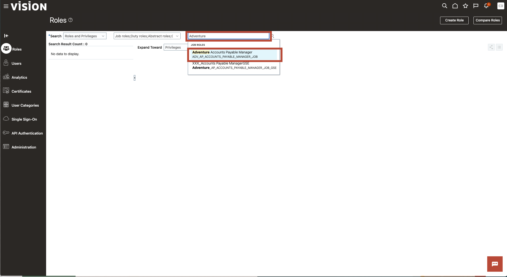
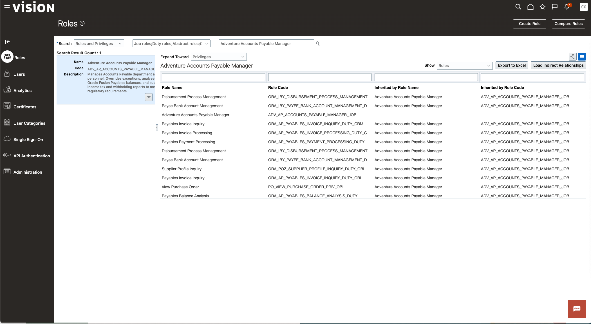
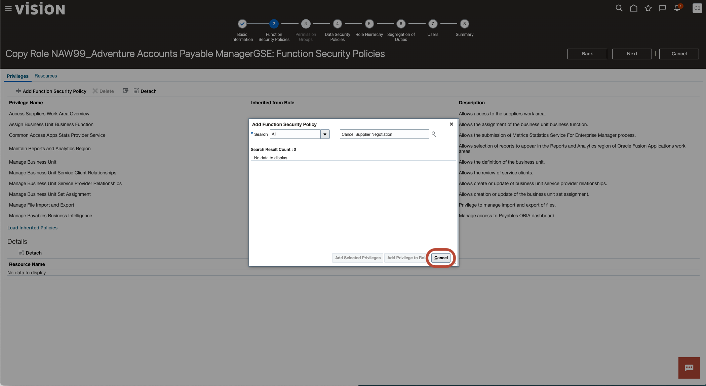
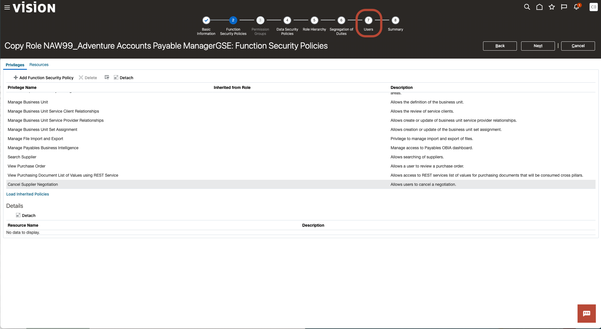
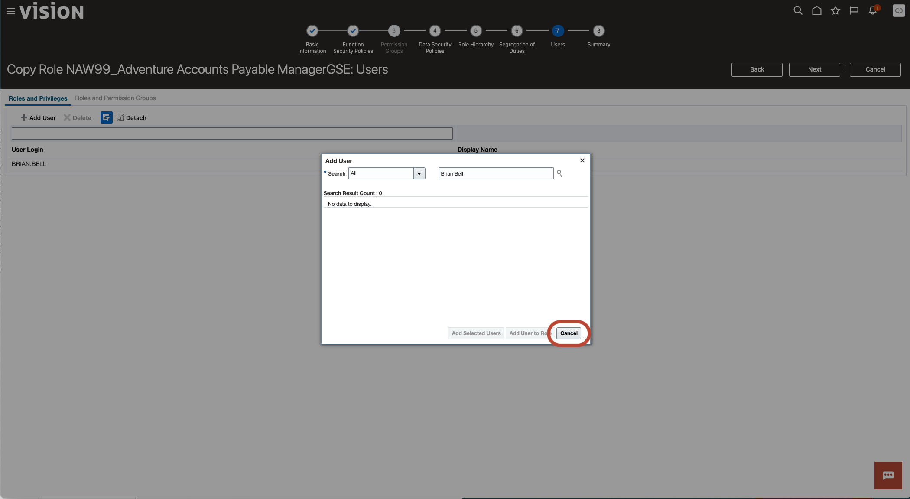
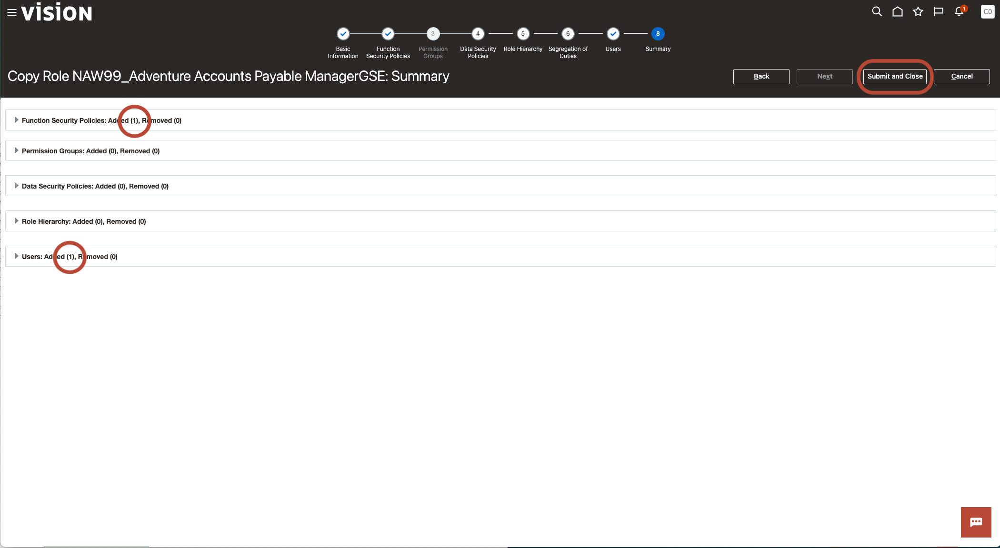
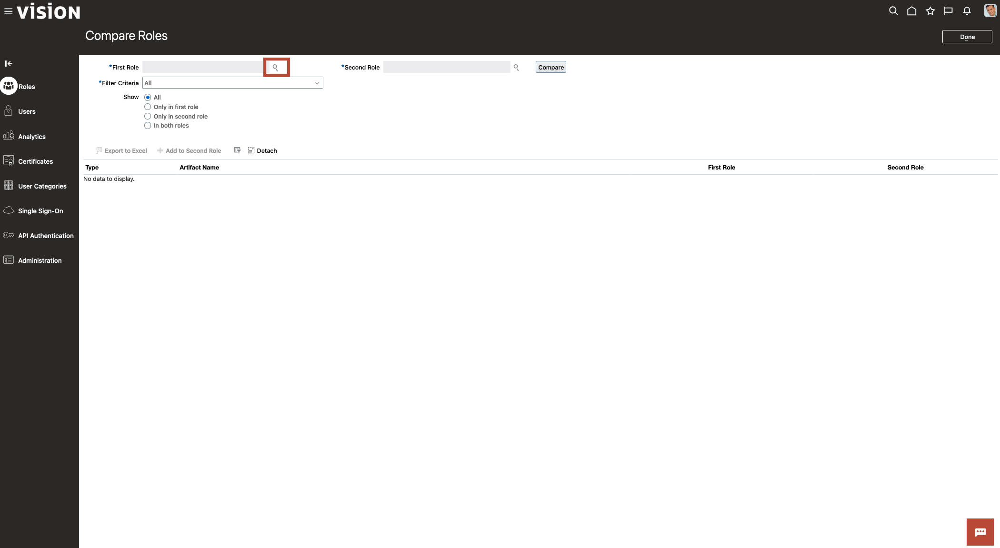
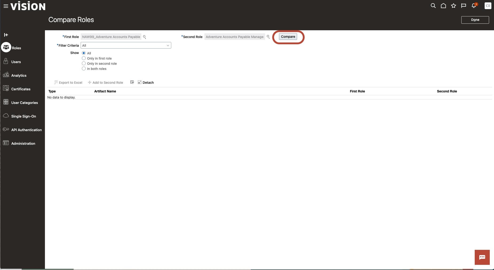

# Security

## Introduction

We're delighted to take you on a journey that will uncover the incredible capabilities of Fusion Cloud's REST API integration tools for auditing supplier address changes. This adventure is designed to offer a holistic understanding of how these tools can streamline your supply chain security management, providing an efficient way to keep track of supplier information changes.

In the office of the Chief Information Officer (CIO), supply chain management is a complex web of interconnected processes. Our goal is to navigate this complexity and equip you with the skills to audit supplier address changes effectively. You'll learn how to leverage the power of Fusion Cloud's REST APIs, a game-changing solution that will revolutionize your operations.

We've designed this journey to be interactive and engaging. Make sure to answer the Adventure Check Point questions along the way, ensuring you capture the full potential of this experience. These check points are your path to becoming a master auditor, so pay close attention!

With your adventure hat on and a curious mind, prepare for an exhilarating exploration of Fusion Cloud's REST API integration features. Let's embark on this thrilling journey together!

Estimated Time: 15 minutes

### Objectives

In this activity you’ll learn the different ways to manage user access and to secure your Oracle Fusion Cloud Applications.

## Task 1: Log In

1. Enjoy these opening minutes to get you acquainted with the Oracle solution

    Log in as your assigned user

     > Click **Checkbox** next to the following fields.  Note that you may need to scroll the list of fields:  
           - Select the url provided to you  
           - User ID: Use assigned user name  
           - Password: Provided Separately  
           - Click Sign in  

    

## Task 2: Audit Alert

1. Our system administrator notices audit results showing failed logins from an employee.

    > Your administrator will demonstrate the viewing of audit data collected in real time from the Oracle Cloud Applications and displayed in a simple dashboard.

    

2.  Most user management tasks are performed in a single set of screens using the Security Console.

    > Your administrator will demonstrate accessing the Security Console from the Tools Menu

    

3.  While the applications will automatically lock a user after too many failed login attempts, our user has not reached that limit.  But due to other suspicious activity on the network, our administrator uses the Cloud Console to lock the account

   > Your administrator will demonstrate for to Find the user (Brian.Bell) and Lock the user from the Actions menu
   
    

## Task 3: Extending Privileges to a User

1. Oracle Cloud Applications are delivered with a complete set of roles which control access to application functions and data.  

    To add a new privilege to a user, you will need to first copy an existing role.

    > If not logged in, follow the steps provided to you for accessing your Oracle Cloud account

      

    > Look to the upper right of your screen to find the Star which is your Favorites Menu

     

2.  Accessing Security Console 

    > From the Favorites Menu, click on **Security Console**

      

3. You’ll be working from this single console for most of the examples today.  By default, you are viewing the Roles tab of the console.
   
    > Security Console - Roles

      

4. Notice how the search is dynamic and offers available options as you type.

    > (1) In the search field provided at the top, type **Accounts Payable Manager**  

    > (2) Click the **Finish** button.

      

5. You can now see a list of the roles which are granted to a user when they are provided with the Accounts Payable Manager.  

    > (1) Notice that the table may be exported to Microsoft Excel using the button provided at the top right.  

    > (2) Clicking on the **Show Graph** icon will display the role privileges in a graphical display.

    

6.  This graphical view is a great way to understand how sets of privileges and roles are assigned in groups and hierarchies. 

    > Returning back to the table view is as easy as pressing the **View as Table** icon.

    

7.  Always make changes to a copied role to ensure that your custom configurations are preserved on updates.

    > Tasks associated with the role are available from this pull-down menu.  Select **Copy Role**

    

    > (1) Select **Copy top role**  

    > (2) Press the **Copy Role** button.

    

8.  Notice that you provided with a list of ordered steps at the top.  For this example we will only provide answers to steps 1, 2 and 7.

    We start by giving our copied role a unique name.

    > (1) Add **your initials** to the end of the role name and role code as shown.  

    > (2) Press the **Next** button

    

9.  Using Function Security Policy, you will add the privileges Brian Bell needs

    > Press the **Add Function Security Policy** button

    

10.  You will now find the required policy using the search form.

    > Type **Cancel Supplier Negotiation** in the search field then select the privilege with that name.

    

    > Press the **Add Privilege** to Role button

    

11. Note that the search window did not automatically dismiss.  This is done so you can continue to add more policies in this process.

    > Press the **Cancel** button to continue

    

9. Note that the new policy has been added

    > Press the **Next** button

    

10.  You will skip the next three tasks.  

    Each of these next screens illustrates how much granular control you have over access to application features and data.

    No need to add a Data Security Policy

    > Press the **Next** button

    

11. No need to add a role 

    > Press the **Next** button

    

12.  You are skipping this step which examines role conflicts with segregation of duties.

    > Press the **Next** button

       

12. Using a similar search tool, you will now search for Brian Bell and provide him with this new role and its associated privileges.

    > Press the Add User button

    

    > Type **Brian.Bell** in the search form then select his name below when found.  Be sure to use the period between the first and last name.

    

    > Press the **Add User to Role** button

    

    

13. Again, the search box remains in case you want to add additional users.

    > Press the **Cancel** button

    

14. Brian Bell has been added to this new role

    > Click the **Next** button

    

15. Note confirmation that we have added one Security Policy and one user

    > Press the Submit and Close button

    

16. Last screen confirms new role is added.

    > Press the OK button

    

## Task 4: Compare Roles 

1.  Using the compare roles feature, you can quickly identify changes you’ve made compared to the out of the box roles provided by Oracle or other custom roles.

    This section uses your newly created role to do exactly this.

    > From the Security Console, press the **Compare Roles button**

    

2.  You will need to enter the name of your new role

    > Press the **Search** icon for the First Role

    

    > Type in your **three initials** which you used to name your custom role

    

    > Select your custom role

    

    > Press the **OK** button

    

3.  Now you will repeat these steps for the original role

    > Press the **Search** icon for the Second Role

    

    > (1) In the search field type **Accounts Payable Manager**  

    > (2) Select the first entry

    

    > Press the **OK** button

    

    > Press the **Compare** button

    

4.  Immediately you see that Cancel Supplier Negotiation has been added to the first role and does not exist in the second role.

    > Press the **Only** in first role toggle button

    

5.  With this new view, you see that two additional inherited roles were added to the custom role when you added Cancel Supplier Negotiation to the role.

    

    > Review the Demo Flow for the Audit History Audit REST API
	

16. Adventure awaits, click on the image, show what you know and rise to the top of the leader board!!!
    
     

## Summary

Security Console is used to quickly manage user access to the entire Fusion applications suite.

To end this portion of the Cloud Adventure, your class administrator will activate Brian Bell’s account, and demonstrate the Simulate Navigator.

**You have successfully completed the Activity!**

## Acknowledgements
* **Author** - Nate Weinsaft, Sales Consultant, Advanced Technology Services
* **Contributors** -  
* **Last Updated By/Date** - Nate Weinsaft, August 2024
