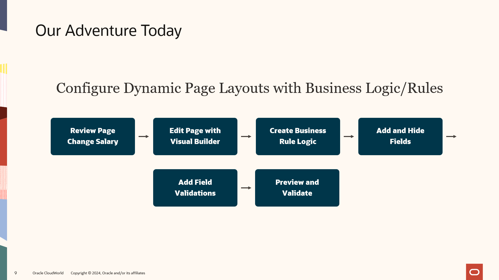
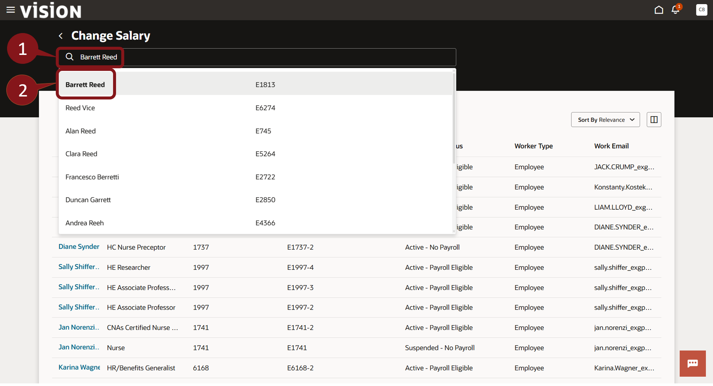
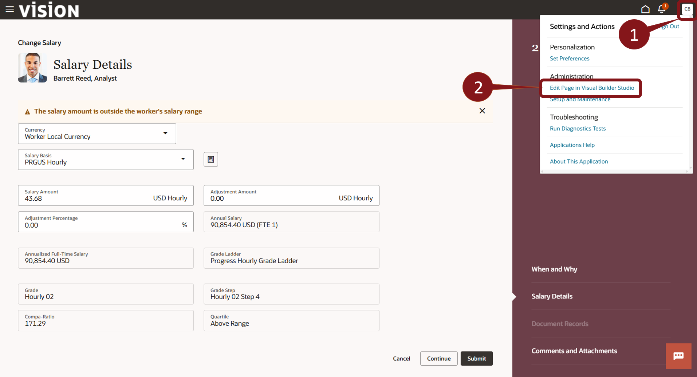

# Configure

## Introduction

Oracle offers hundreds of prebuilt pages, workflows and forms “out of the box” as part of the Oracle Fusion Cloud.  Many of our customers want to configure these pages and workflows to meet their specific business needs.  You can unify your experience in our applications by using Redwood.

Oracle Redwood is Oracle Fusion’s new design system that enhances the user experience through a visually stimulating, easy-to-use interface. By uniting customer-inspired design philosophies with industry-leading technology solutions, Oracle Redwood helps companies reduce costs, foster efficiency, revitalize the customer journey, and evolve continuously toward the future.   

In this exercise, you are the Redwood expert for your organization.  You will use Redwood, Oracle’s next-generation design system, to quickly and efficiently design a Change Salary Interface for Non-HR mangers.

Do not forget to answer the Adventure Check Point questions at the end of the exercise! 

Estimated Time: 15 minutes

### Objectives

In this activity, you will use Redwood to incorporate rules and define content surfaced in the application to tailor the user experience. 

.

## Task 1: Enhance the Change Salary Experience

1. You are the Redwood expert for your organization.  You will use Redwood, Oracle’s next-generation design system, to quickly and efficiently design a Change Salary Interface for Non-HR mangers.

    Change Salary is a dynamic form that allow you to create pages with user information that appears based on conditions you configure.

    You will first navigate to the Change Salary Page.

    > From the application home page, click on the **My Team** tab.

    .

    > Click on **Change Salary** under **Quick Actions**.

    

    > Click on the  **Icon** to remove the Direct Reports Filter because your user does not have any direct reports.  This action allows you to see other people.

    

2. Now you will enter the Change Salary Form so we can make the required changes using Visual Builder Studio.  Now you will select a person so you can enter the Change Salary form.

    > (1) Search for **Barrett Reed** in the search box.  

    > (2) Select **Barrett Reed** in the drop down (add new picture).  

    

3.  You have entered the Change Salary Form.  Now you will quickly review the current configuration of the Change Salary Form.

    > Click **Continue**.

   

    > (1) Enter a **future date** for **When does the salary will start.**  

    > (2) Select **Change Salary** for **What is the action name.**  

    > (3) Select **Career Progression** for **why you are changing the salary for Barrett Reed?**  

    > (4) Click **Continue** once complete.

    

4. You will now create new rule that hides Annualized Full-Time Salary because it is repetitive.  You will also hide Compa-Raito since this is mainly used by HR.  You also want to show the action reason in this sction of the Change Salary Form.

    

5. Now you will enter the Visual Builder Studio.

    > (1) Click on **The**  **Image** in the top right corner of the screen.   

    > (2) Then select **Edit Page in Visual Builder Studio**.

    

    The following image appears as Visual Builder Studio is loading.

    

6.  Welcome to Oracle Visual Builder Studio (VB Studio), a robust application development platform that helps your team effectively plan and manage your work throughout all stages of the app dev lifecycle: design, build, test, and deploy.

    Now we will use VB Studio to make the required changes to the Change Salary Form.

    > Click on **Configure Fields and Regions**.

    

7. First we will create a new form rule for change salary.

    > Click on the  **Icon** to add a new form rule.

    

    > (1) Enter **Change Salary Non-HR** in label.  

    > (2) Click on **Create**.

    

8.  Note that rules are based on a hierarchy.  The rules on top supersede the rules below .

    Now we will add the conditions that applies this rule to all non-HR personnel

    > Click on the **Edit button.**

    
    
    > (1) Click on **contains** in the User Roles Row.  

    > (2) Select **does not contain** from the drop down options.  

    

    > Then enter the **Human Resource Manager** role in the right most box.

    

     **Note:** This configuration routes the this version of the Change Salary Form to all people who are not assigned to the Human Resource Manager Role

10.  Now you want to add and hide fields.

    > Click on the **Drop Down**  Icon to the left of Salary to expand the salary section.

    

11.  First you want to the configure the form to hide Annualized Full-Time Salary Field.

    > (1) Click in the Box in the **Hidden Column** for **Annualized Full-Time Salary Field** row.        

    > (2) Then select **Hidden** from the options that appear.

    

12. Now you want to the configure the form to hide Compa-Ratio.

    > (1) Click in the Box in the **Hidden Column** for **Compa-Ratio** row.        

    > (2) Then select **Hidden** from the options that appear.

    

12. Now you will configure the form to show action reason

    > (1) Click in the Box in the **Hidden Column** for **Action Reason** row.        

    > (2) Then select **Visable** from the options that appear.

    

13. Please verify that Action Reason is **Visable**, and Annualized Full-Time Salary Field and Compa-Ratio are **Hidden**.

    Now you will add a validation step for the Adjustment Percentage.  You do not want users to enter in a Salary Percentage Greater than 15%

    > Click on **Validate Field Values**

    

    > Click on **+ Validation**

    

    > (1) Enter **Adjustment Percentage** in **Label** to name the validation.     

    > (2) Then Click **Create**.

    

14.  Now you will set the conditions for this rule so that the form will not accept any adjustment percentage greater than 15%.

    > Click on the **Edit**

    

    > Click on **+ Condition**.

    

    > (1) Start Typing **Adjustment Percentage.**      

    > (2) Then select the first **Adjustment Percentage.** under **Salary Details**.

    

    > (1) In the new Adjustment Percentage row you just created, click the **middle box** that says **Equals**.        

    > (2) Then select  **greater than.**.

    

    > Enter **15** in the right most box in the Adjustment Percentage row.

    

    The form will not allow any user to enter an adjustment percentage greater than 15%. 

15.  Now you will configure the error message users will see if they enter in an Adjustment Percentage greater than 15%.

    > (1) Under **Messages**, Enter **Adjustment Percentage is too high** in **Summary**.     

    > (2) Then enter enter **The Adjustment Percentage nust be lower than 15%** in **Detail**.

    

    > Click on **Warning** under **Severity**.

    

    > (2) Then select **Error** from the drop down options that appear.

    The error configuration will not allow any user who entered incorrect data to submit the change without fixing the error

    
    

16.  Well done.  You have configured a new rule for Non-HR personnel.

    Redwood offers a quick way to review your changes as they appear in the application.

    > (1) Click on the **Review icon** in the upper right of  the screen.    

    > (2) A new window will pop up.

    

17.  You have reentered the Change Salary Form.  Let’s review the changes.

    > Click **Continue**.

    

    You need to enter the required information before you can move to the next screen.

    > (1) Enter a **future date** for **When does the salary will start.**  

    > (2) Select **Change Salary** for **What is the action name.**  

    > (3) Select **Career Progression** for **why you are changing the salary for Barrett Reed?**  

    > (4) Click **Continue** once complete.

    

18.  Note that Annualized Full-Time Salary and Compa-Ratio are no longer visible while Action Reason is now Visible.

    Now we will test the validation for the Adjustment Amount Percentage.

    > Enter an Adjustment salary that is greater than 15%.

    

19.  The system gives us a warning that the increase in salary is outside the worker’s salary range.  You will ignore this warning.

    > Click **Continue.**

    

20.  The system will not allow the user to continue because the Adjustment Salary percentage exceeds 15%

    

    > Click on the **Home**  Icon.

    

21. Adventure awaits, click on the image, show what you know and rise to the top of the leader board!!!

     

## Summary

Oracle Redwood is Oracle Fusion’s new design system that enhances the user experience through a visually stimulating, easy-to-use interface. By uniting customer-inspired design philosophies with industry-leading technology solutions, Oracle Redwood helps companies reduce costs, foster efficiency, revitalize the customer journey, and evolve continuously toward the future.   

Oracle Visual Builder Studio (or VB Studio, for short) is an integrated development platform that helps your team effectively plan and manage your work throughout the application's lifecycle. It combines the simplicity of a visual development environment with powerful management tools to streamline application development and deliver modern, innovative user experiences.

In this example, you used Redwood, Oracle’s next-generation design system, to quickly and efficiently enhance the Change Salary Page

**You have successfully completed the Activity!**

**For extra credit (and possibly some Oracle swag) please make sure you record the information regarding the Item with highest Lead Time Variance Percentage in the review Item Category Set.**

## Acknowledgements
* **Author** - Casey Doody, Sales Consultant, Advanced Technology Services
* **Contributors** -  Sajid Saleem, Master Principal Sales Consultant, Advanced Technology Services
* **Last Updated By/Date** - Casey Doody, August 2024

