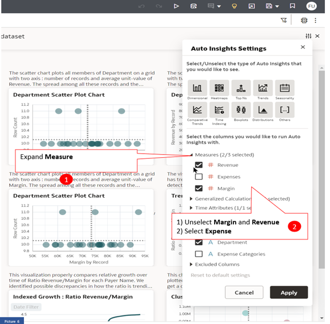
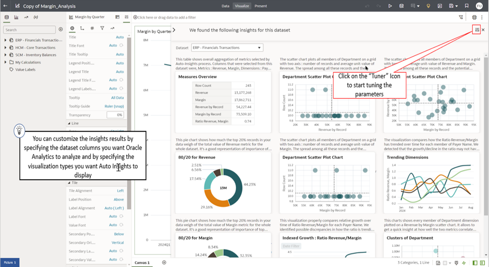
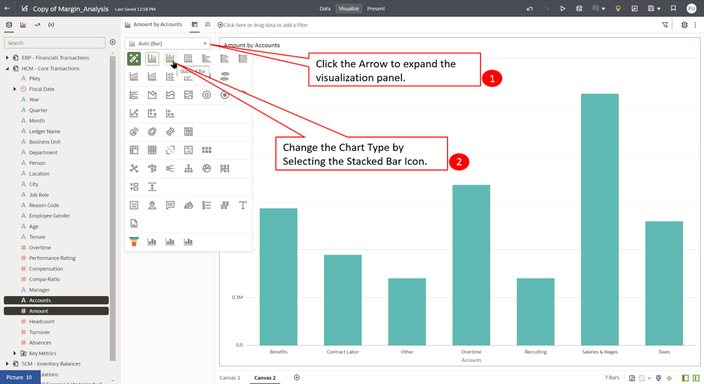

# Connections
 
## Introduction
 
This is a fresh and unique way to offer you a chance for hands-on experience of highly differentiated and specifically curated content of numerous vignettes that are typically encountered in accounting and finance. We hope you will enjoy today’s adventure exploring a complete and unified solution for the office of the CIO.

As you follow along, do not forget to answer the Adventure Check Point questions! 

Estimated Time: 7 minutes

### Objectives

In this activity you’ll learn the different ways to manage user access and to secure your Oracle Fusion Cloud Applications.

## Task 1: Change the already existing comprehensive supplier assessment in Supplier Qualification Management.

1. In efforts to improve the tracking of ESG data for suppliers, your company has decided to make it mandatory to gather CSR scoring data from existing and new suppliers. You will do this easily by changing the already existing comprehensive supplier assessment in Supplier Qualification Management.

    > Navigate to the **Procurement** tab and select **Supplier Qualification**.

    

2. You are now looking at the Supplier Qualification Management dashboard, where you can see anything going on with supplier initiatives at any given times. All the data on the dashboard is drillable but for now you are going to use the task menu to the right to access the necessary work area.

    > In the far-right side of the screen select the **Tasks** menu.

    

3. Corporate has already provided the questions and information suppliers will be required to provide so you just need to add this info to an existing qualification model. 

    > Click the **Manage Qualification Models** hyperlink to access the management dashboard.

    

4. Using comprehensive search and sorting capabilities you can create and save inquiries to find any model you need to work on at any given moment. 
    
    At the bottom of the page are the suppliers. Four were invited, and three responded. You can see the details to the right. Once again you will notice EIP was ranked first but still wasn’t awarded so you must dive deeper.

    > Select **Supplier Assessment Score** hyperlink under the Qualification Model column.

    

    Now you need to change the Supplier Assessment Score model. This is the model used as part of the onboarding and/or spend authorization process.

5. When you drill into the model you will be provided all the details of the selected model. This is where you can set up, manage, and change rules and attributes for the qualification model

    > First, review the general information to ensure you are editing the correct model.

    Then, select the **Areas and Outcomes** icon from the left margin.

    

6. When you navigate to Areas and Outcomes, you can drill into the existing questions all the way down to scoring criteria and requalification rules for each. You will also notice this is where we will rate your supplier base depending on their responses and scores. All this information will also be reportable once collected. 

    > Once the Areas and Outcomes screen is open, click on the **Select and Add** icon to add new qualifications to this model.

    

7. In the Qualifications Areas tools, you can once again use comprehensive search tools to find the correct qualifications to add to your model. Corporate already provided the pre-approved qualification to help save all the various business units time, so you will simply need to locate and add the new section. Users can also create and add new sections ad-hoc given the correct permissions.

    > Under the search criteria look for the new **CSR Scoring** qualification area. 

    

    > Select the new **CSR Scoring Qualification Area** and click **OK** to add it to the existing qualification model.

    

8. Once the new Qualification Area is added to your model you can review and validate information. Users can also validate and preview what the new model will look like with the new section.

    > Once the new section has been added to the qualification model, you can review all the questions and how they branch by selecting the **Actions** drop-down, then clicking on **View Question Branching**

    

9. When you review the question branching, you will notice that by adding the CSR Scoring section there are a couple questions that were added to the model. This will ensure that existing suppliers and any new suppliers will all be assessed for their CSR rating.

    After reviewing the questions you will need to go back to the landing page.

    > For our purposes today, click the **Home** button so you can navigate back to the Procurement landing page.

    

    > You will be prompted to make sure you wish to exit without saving changes. Click **OK** to go back to the landing page without saving.

    

10. Adventure awaits, click on the image and show what you know, and rise to the top of the leader board!!!
    
     

## Summary

Supplier Qualification Management gives you everything you need to ensure compliance and manage vendor relationships.

Identify and capture all compliance and demographic information you need from your vendors in one place.

Monitor vendor data constantly and quickly identify and rectify any issues.

Seamlessly add and manage an ever-changing set of business requirements to ensure you are doing business with the right people.

**You have successfully completed the Activity!**

## Acknowledgements
* **Author** - Matt Bailey, Staff Solution Engineer
* **Contributors** -  Betty Jane Madden, Principal Solution Engineer
* **Last Updated By/Date** - Matt Bailey, August 2024

