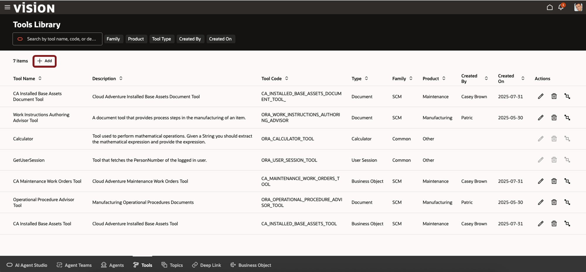
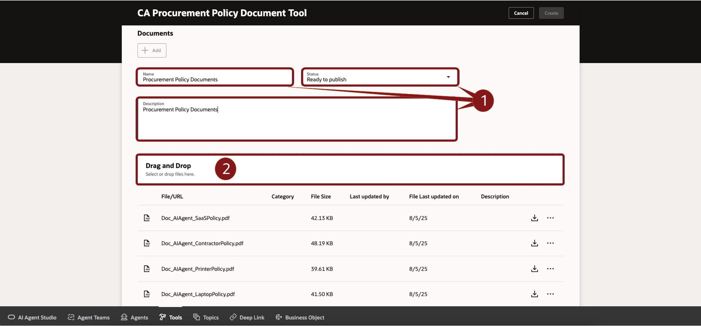
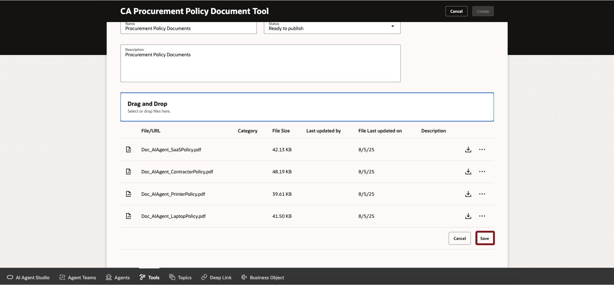
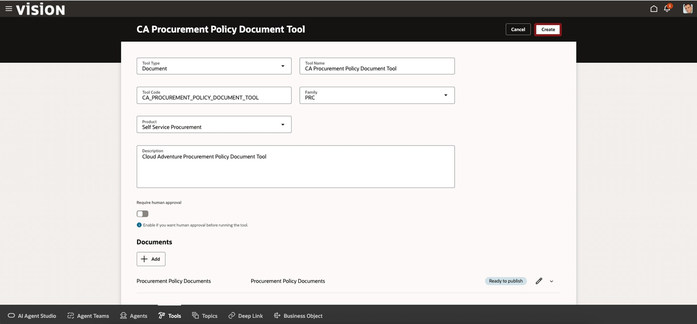
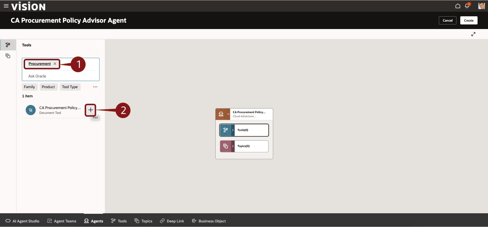
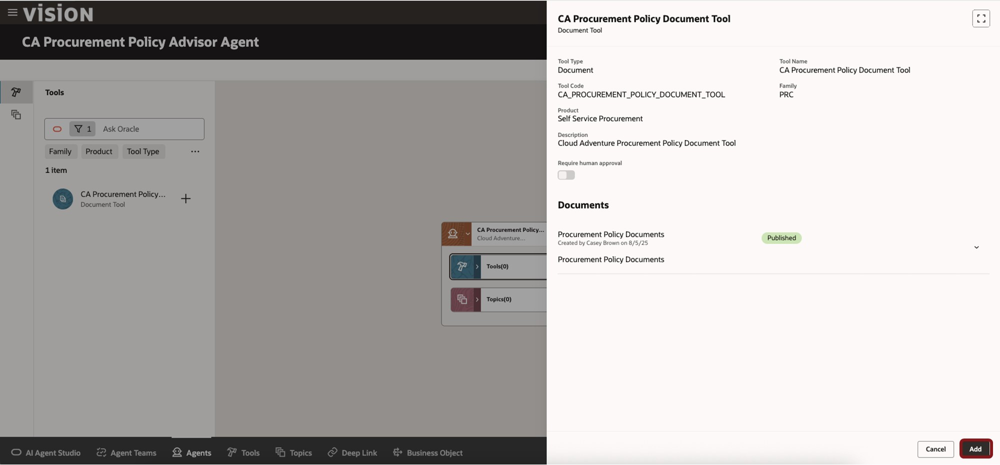
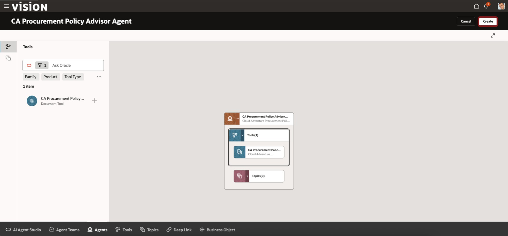
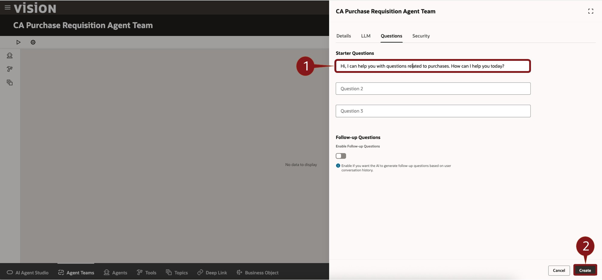
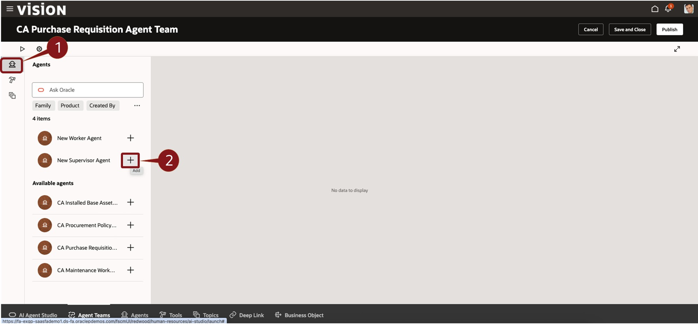

# Audit

## Introduction

AI Agent Studio is a design-time environment that empowers you to create, configure, validate, and deploy GenAI features and AI agents to meet your organization's needs. With AI Agent Studio, you can easily extend pre-configured agent templates, and even build new agents and multi-agent workflows from scratch. AI Agent Studio is fully integrated into Fusion Applications, providing secure and seamless access to the knowledge stores, tools, and APIs of Fusion Applications. This integration enables agents to be deployed directly into the workflow, ensuring an efficient process.

### **Objectives**

In this activity you will use Oracle Fusion AI Agent Studio to
•	Create a Document Tool to ingest company-specific procurement policy documents (PDF) 
•	Create an Agent that uses the Document Tool to respond to user queries
•	Create and assemble an Agent team that includes the created Agent and purchase requisition action agent.
•	Test the Agent team 

## Create Agents and an Agent Team using AI Agent Studio

1. In this activity you will learn the power and ease building Agentic AI with the Oracle AI Agent Studio 

    

2. The first step is to navigate to AI Agent Studio. 

    > (1) Click on the **Tools** tab
    > (2) Select the **AI Agent Studio** tile

    

3. Next, we're going to create a Tool

    > Click the  button/tab at the bottom of the page

    

4. Tool Creation

    > Click the  button to create a new tool

    

5. Here, you will define your first Tool, a Document Tool.  This will allow the Agent to use the content of the documents to respond to user questions.

    > (1) Enter the following fields:
      - Tool Type: select **Document** from the dropdown 
      - Tool Name: Enter **CIO## Procurement Policy Document Tool**, where **##** is replaced with your user number. 
      - Family: select **PRC** from the dropdown 
      - Product: select **Self Service Procurement** from the dropdown 
      - Description: Enter **Cloud Adventure Procurement Policy Document Tool**  
    > (2) Click the  button under **Documents**
    
    

6. **Note:** Now we’ll add the documents to our tool.  The documents you will add are located in the **Procurement Documents** folder on your laptop's Desktop.

    > (1) Enter the following fields:
      - Name: Enter **Procurement Policy Documents**  
      - Status: Select **Ready to publish** from the dropown 
      - Description: Enter **Procurement Policy Documents** 
    > (2) Click on the  region  
    Select all files from the **Procurement Documents** folder on the Desktop. Alternatively, drag and drop the files that folder to the Drag and Drop region.

    

7. After all 4 files/documents have been loaded, you can proceed with the Save.

    > Click the **Save**  button on the botton right

    

8. You're now ready to save your knew Document Tool.

    > Click the **Create button**   on the near to the of the screen.

    

    **Congratulations!  You’ve completed your first step and created a Policy Document Tool.**

    
9. Now, you'll create your first Agent!  You'll do that from the Agent screen within the AI Agent Studio.

    > Click the  **Agents** button/tab [Agent Image](images/agenticon.jpg) at the bottom of the page.

    

10. Here, you can see any existing agents.  But you want to create a new one.

    > Click the  **+ Add** button [Add Button Image](images/addw.jpg).

    

11. Define the Details of the Agent.

    > (1) First, you'll enter the fields as described below:
      - Agent Name: **CIO## Procurement Policy Advisor Agent** where ## is replaced with your user nnumber. 
      - Family: Select **PRC** from the dropown 
      - Product: Select  **Self Service Procurement** from the dropdown 
      - Maximum Interactions: **10**  
      - Description: **Cloud Adventure Procurement Policy Advisor Agent**  

         Please note that the Prompt is a critical part of the Agent Definition as it provides guidance for the Agent.  To streamline this step, we've pre-created the prompt.  It's available as described below.

      - Prompt: The value for the prompt field is available in the **Prompt – CA Procurement Policy Advisor.txt** file that is available in the **Procurement Prompt** folder on your desktop.  Please open this file and copy the contents into the Prompt field.  
    > (2) Click the Create Button   

    

12. You’ve now created your first Agent.  Now you’ll add Tools to the Agent.  You'll add a mix of standard tools, tools created earlier in the Cloud Adventure, and tools that you've just created.

    > Click the Tools icon  on the left.
    
      

13. Find the appropriate tool and add it to your agent.

    > (1) Enter **Procurement** in the Ask Oracle field and select **Procurement** from teh resulting dropdown.  This filters the list of tools for easier selection.
    > (2) Click the  next to the tool name **CA Procurement Policy Document Tool** 

    

14. You can review teh details of the Tool, including the option to require human approval.

    > Click the Add button .
    
      

15. That's it! Let's save this and continue.

    > Click the **Create** button  on the top right.
    
      

16. You’ve just created your first Agent, complete with added Tool(s).  Next, you’ll create an Agent Team with a Supervisory Agent and assign some worker agents.

    > Click the **Agent Teams** button/tab  on the button of the page.
    
      

16. Create an Agent Team.

    > Click the **+ Add** button .
    
      

17. Define the Agent Team.

 > (1) Enter the fields as described below:

      - Agent Team Name: **CIO## Procurement Requisition Agent Team** where ## is replaced with your user nnumber. 
      - Family: Select **PRC** from the dropown 
      - Product: Select  **Self Service Procurement** from the dropdown 
      - Maximum Interactions: **20**  
      - Description: **Purchase Requisition Agent Team leverages worker agents Procurement Policy Advisory and Purchase Requisition Agent.**  
> (2) Click the Questions tab  
    
   

18. You can provide one or more starter questions to assist users in interacting with the Agent Team.

 > (1) In the Question 1 field, enter: **Hi, I can help you with questions related to purchases.  How can I help you today?**
 > (2) Click the **Create** button  on the bottom right.
    
   

19. You’ve defined your Agent Team, so it’s time to add a Supervisor agent.

 > (1) Click the **Agents** icon .
 > (2) Click the **+** icon  next to **New Supervisor Agent**.
    
   

20. Define Supervisor Agent Details.

 > (1) Enter the fields as described below:

      - Agent Team Name: **CIO## Procurement Requisition Supervisor Agent** where ## is replaced with your user nnumber. 
      - Family: Select **PRC** from the dropown 
      - Product: Select  **Self Service Procurement** from the dropdown 
      - Maximum Interactions: **10**  
      - Description: **Cloud Adventure Purchase Requisitions Supervisor Agent**  
 > (2) Click the **Create** button  on the bottom right.
    
   

    

## Summary

As you have seen, the Oracle SaaS applications may be configured to capture who updates select fields, when the update was performed, the previous value and the updated value. Having this level of auditing serves a critical role in providing governance and controls over your enterprise applications. As an administrator, you will implement the controls your company chooses to enforce. The combination of fine grained applications security and application data audit provide the end to end controls you will need.

This Cloud Adventure also featured the importance of having open REST interfaces for accessing and sharing data with external systems. In the case of audit data, you may want to send this data to a SIEM or data warehouse for analysis.

**You have successfully completed the Activity!**

* [Oracle Supply Chain & Manufacturing - APIs & Schema](https://docs.oracle.com/en/cloud/saas/supply-chain-and-manufacturing/24b/api.html)
* [Set Up Auditing for Oracle Fusion Applications](https://docs.oracle.com/en/cloud/saas/applications-common/24d/facia/set-up-auditing-for-oracle-fusion-applications.html)
* [Oracle Documentation](http://docs.oracle.com)O

## Acknowledgements
* **Author** - Jamil Orfali, Senior Cloud Technologist, Advanced Technology Services; Kris Holmgren, Senior Cloud Technologist, Advanced Technology Services.
* **Contributors** -
* **Last Updated By/Date** - Jamil Orfali, April 2025
