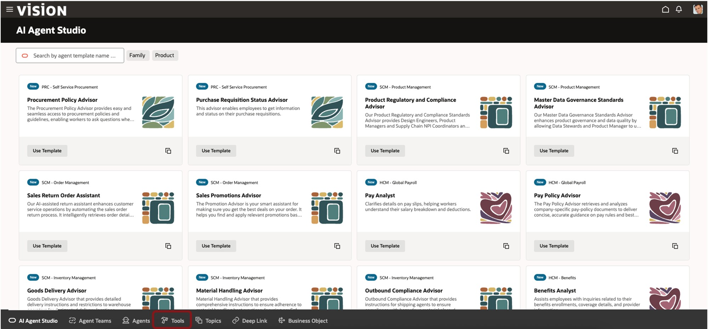
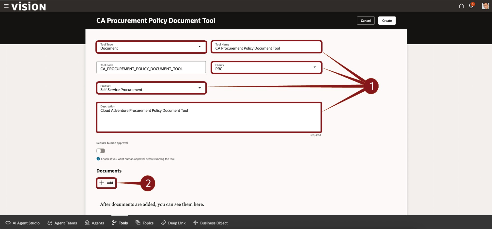

# Audit

## Introduction

AI Agent Studio is a design-time environment that empowers you to create, configure, validate, and deploy GenAI features and AI agents to meet your organization's needs. With AI Agent Studio, you can easily extend pre-configured agent templates, and even build new agents and multi-agent workflows from scratch. AI Agent Studio is fully integrated into Fusion Applications, providing secure and seamless access to the knowledge stores, tools, and APIs of Fusion Applications. This integration enables agents to be deployed directly into the workflow, ensuring an efficient process.

### **Objectives**

In this activity you will use Oracle Fusion AI Agent Studio to
•	Create a Document Tool to ingest company-specific procurement policy documents (PDF) 
•	Create an Agent that uses the Document Tool to respond to user queries
•	Create and assemble an Agent team that includes the created Agent and purchase requisition action agent.
•	Test the Agent team 

## Create Agents and an Agent Team using AI Agent Studio

1. In this activity you will learn the power and ease building Agentic AI with the Oracle AI Agent Studio 

    

2. The first step is to navigate to AI Agent Studio. 

    > (1) Click on the **Tools** tab

    > (2) Select the **AI Agent Studio** tile

    

3. Next, we're going to create a Tool

    > Click the  icon at the bottom of the page

    

4. Tool Creation

    > Click the  button to create a new tool

    

5. Here, you will define your first Tool, a Document Tool.  This will allow the Agent to use the content of the documents to respond to user questions.

    > (1) Enter the following fields:
      - **Tool Type**: select **Document** from the dropdown 
      - **Tool Name**: Enter **CIO## Procurement Policy Document Tool**, where **##** is replaced with your user number. 
      - **Family**: select **PRC** from the dropdown 
      - **Product**: select **Self Service Procurement** from the dropdown 
      - **Description**: Enter **Cloud Adventure Procurement Policy Document Tool**  

    > (2) Click the  button under **Documents**
    
    

6. **Note:** Now we’ll add the documents to our tool.  The documents you will add are located in the **Procurement Documents** folder on your laptop's Desktop.

    > (1) Enter the following fields:
      - **Name**: Enter **Procurement Policy Documents**  
      - **Status**: Select **Ready to publish** from the dropown 
      - **Description**: Enter **Procurement Policy Documents** 
    (2) Click on the  region  
    Select all files from the **Procurement Documents** folder on the Desktop. Alternatively, drag and drop the files that folder to the Drag and Drop region.

    

7. Let’s navigate back to the Oracle Fusion Cloud home screen.

    > Click the **Home**  button

    

8. Now, we’re going to discover how we can audit several pieces of information that’s relevant to our cloud adventure today: user access (sign in / sign out) as well as supplier address information changes via REST API integrations.

    > At the home screen, Navigate to **Integration** tab

    

    > Click on **Audit Report REST Endpoints**

    

    **This is an example of a configuration. This tile links out to an external website.**

    **Take note of the detailed documentation. API endpoints, parameters, code examples, use cases, Oracle’s documentation is public and designed to be very useful.**

9. Let’s review the REST API endpoints that we can use to review Auditable data that can be extracted from Fusion Cloud.

    

    > Click on **Get an audit report** under **Audit Report**

    

    > **Click** the drop-down menu icon [drop down icon](images/icon014_downarrow.png) **‘Jump to’** and select the **‘Examples’** menu option

    

    > Scroll down the page, review the first **Example Request Payload** and **Example of Response Body**

    

10. Adventure awaits, click on the image, show what you know and rise to the top of the leader board!!!

    

## Summary

As you have seen, the Oracle SaaS applications may be configured to capture who updates select fields, when the update was performed, the previous value and the updated value. Having this level of auditing serves a critical role in providing governance and controls over your enterprise applications. As an administrator, you will implement the controls your company chooses to enforce. The combination of fine grained applications security and application data audit provide the end to end controls you will need.

This Cloud Adventure also featured the importance of having open REST interfaces for accessing and sharing data with external systems. In the case of audit data, you may want to send this data to a SIEM or data warehouse for analysis.

**You have successfully completed the Activity!**

* [Oracle Supply Chain & Manufacturing - APIs & Schema](https://docs.oracle.com/en/cloud/saas/supply-chain-and-manufacturing/24b/api.html)
* [Set Up Auditing for Oracle Fusion Applications](https://docs.oracle.com/en/cloud/saas/applications-common/24d/facia/set-up-auditing-for-oracle-fusion-applications.html)
* [Oracle Documentation](http://docs.oracle.com)O

## Acknowledgements
* **Author** - Jamil Orfali, Senior Cloud Technologist, Advanced Technology Services; Kris Holmgren, Senior Cloud Technologist, Advanced Technology Services.
* **Contributors** -
* **Last Updated By/Date** - Jamil Orfali, April 2025
