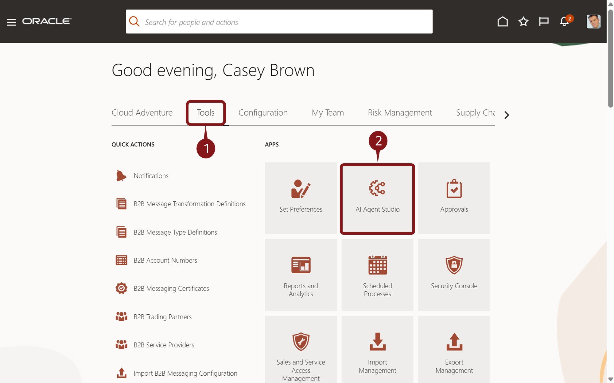
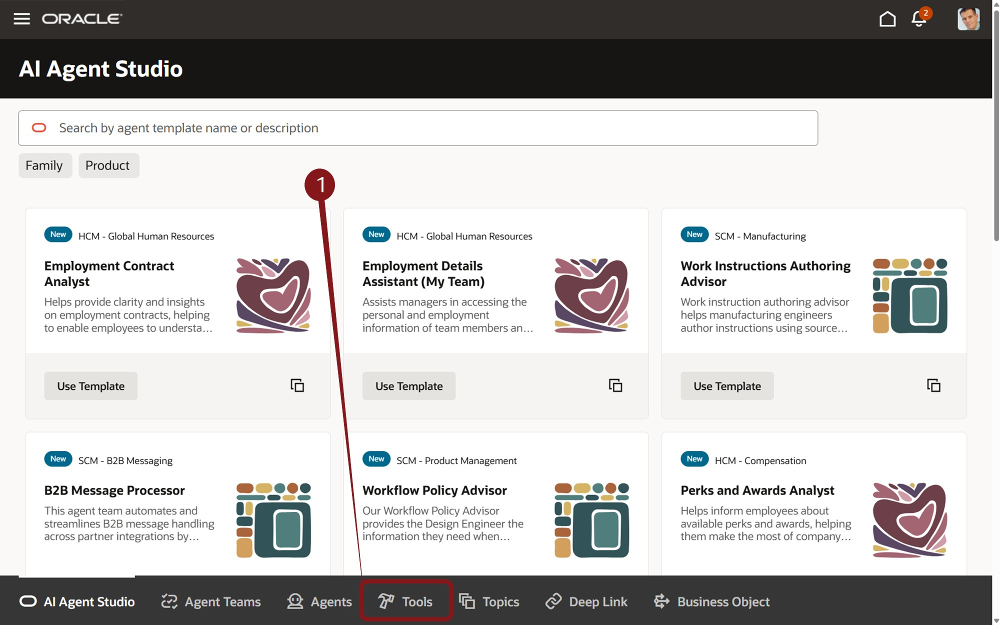
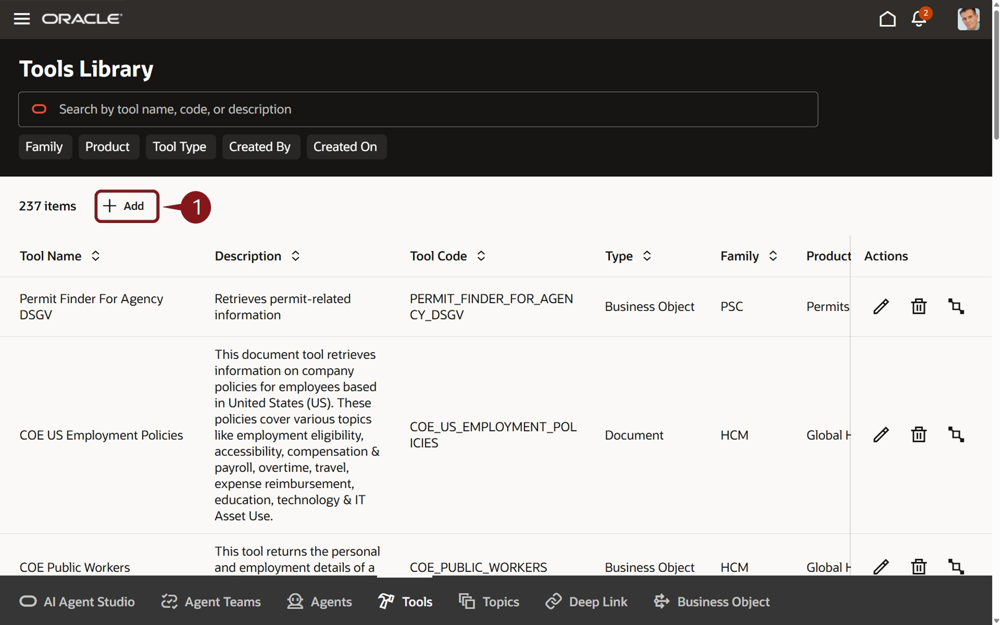
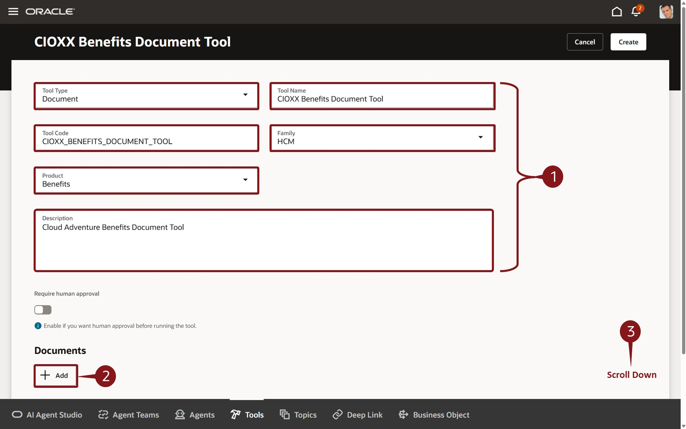
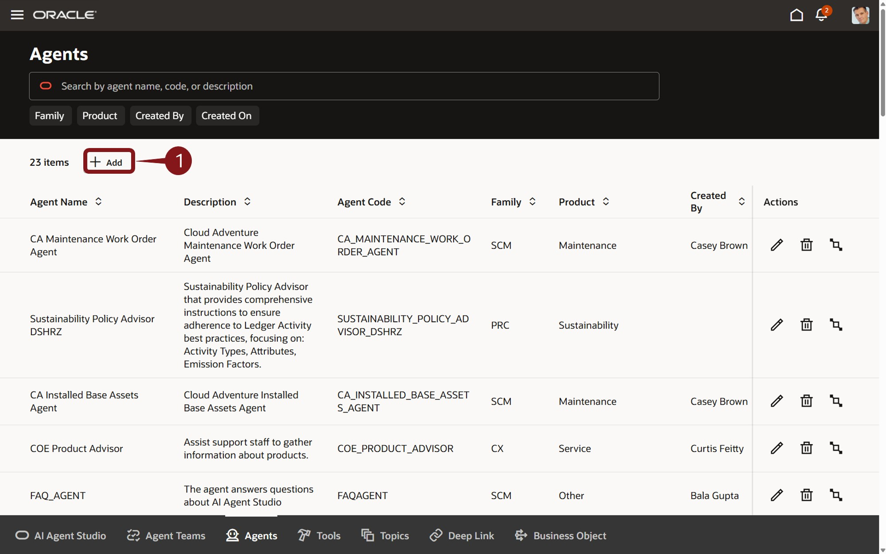
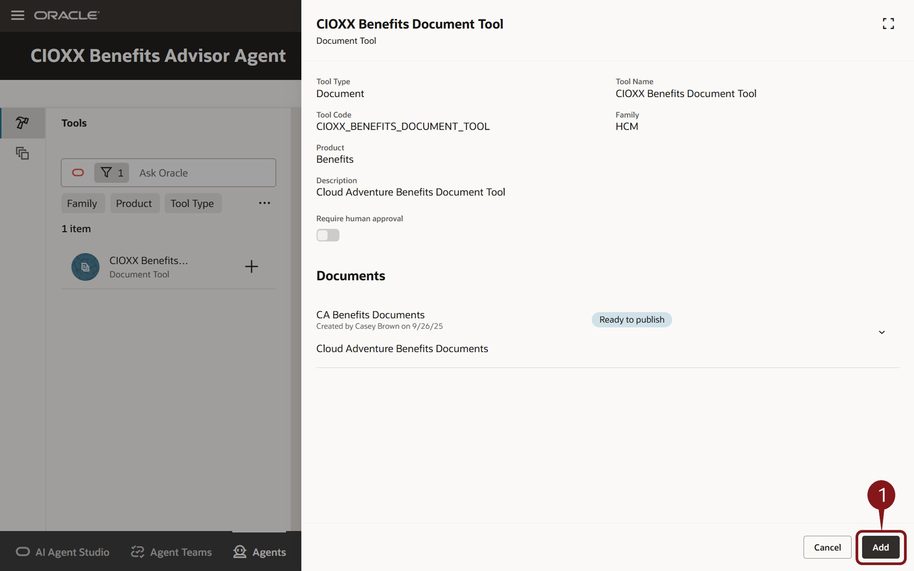
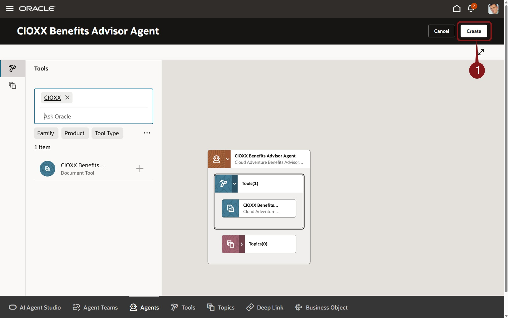

# Create AI Agents and Agent Teams for your enterprise

## Create Policy Advisor Tool and Agent (RAG) using AI Agent Studio

### Introduction

AI Agent Studio for Fusion Applications is a comprehensive platform for creating, extending, deploying and managing AI Agents and Agent Teams across the enterprise. Oracle AI Agent Studio delivers easy-to-use tools, including advanced testing, robust validation, and built-in security, that helps Oracle Fusion Applications customers and partners create and manage AI agents. Leveraging the same technology that Oracle uses to create AI agents, Oracle AI Agent Studio enables users to easily extend pre-packaged agents and/or create new agents and then deploy and manage them.

### **Objectives**

In this activity you will use Oracle Fusion AI Agent Studio to
* Create a Benefits Advisor Document Tool that references you policy documents.
* Create a Benefits Advisor Agent for the above Tool.

### **Begin Exercise**

1. In this activity you will learn the power and ease building Agentic AI with the Oracle AI Agent Studio

    

2. The first step is to navigate to AI Agent Studio.

    > (1) Click on the **Tools** tab
    > (2) Select the **AI Agent Studio** tile

    

3. Next, we're going to create a Tool.

    > (1) Click the  button/tab at the bottom of the page

    


4. Tool Creation

    > (1) Click the  button to create a new tool

    

5. Here, you will define your first Tool, a Document Tool.  This will allow the Agent to use the content of the documents to respond to user questions.

    > (1) Enter the following fields:
    * Tool Type: select **Document** from the dropdown<br>
    * Tool Name: Enter **CIOXX Benefits Document Tool**, where **##** is replaced with your user number.<br>
    * Family: select **HCM** from the dropdown<br>
    * Product: select **Benefits** from the dropdown<br>
    * Description: Enter **Benefits Document Tool** <br>

    > (2) Click the  button under **Documents** <br><br>

    > (3) **Scroll Down** to see the Documents fields and upload your document.

      


6.  **Note:**  Now you’ll add the documents to our tool.  The documents you will add are located in the **ai documents** folder on your laptop's Desktop.

     > (1) Enter the following fields:
    * Name: Enter **CA Benefits Documents** <br>
    * Status: Select **Ready to publish** from the dropdown<br>
    * Description: Enter **Benefits Documents**<br>

     > (2) Click on the  region and then select the file (Cloud Adventure Benefits Highlights.pdf) from the **ai-documents** folder on the Desktop. Alternatively, drag and drop the files that folder to the Drag and Drop region.<br>

     > (3) Click the **Save**  button on the bottom right<br>

     > (4) Click the **Create button**  on the top right corner of the screen.<br>

      

7. Now, you'll create your first Agent!  You'll do that from the Agent screen within the AI Agent Studio.

    >  (1) Click the  **Agents** button/tab  at the bottom of the page.

    

8. Here you can see any existing agents.  But you want to create one.

    > (1) Click the **+ Add** button .

    

9. Define the details of the Agent.

    > (1) First, you'll enter the fields as described below:<br>
    * Agent Name: **CIO## Benefits Advisor Agent** where ## is replaced with your user nnumber.<br>
    * Family: Select **HCM** from the dropown<br>
    * Product: Select  **Benefits** from the dropdown<br>
    * Maximum Interactions: **10** <br>
    * Description: **Benefits Advisor Agent** <br>
    * Prompt:  ***Please note that the Prompt is a critical part of the Agent Definition as it provides guidance for the Agent.***  To streamline this step, we've pre-created the prompt. The prompt text is available in the **Prompt - CA Benefits Advisor Agent.txt** file in the **ai-prompts** folder on your desktop.  So, please open this file and copy the contents into the Prompt field.  Alternatively, you can copy the prompt from the **copy block** below. <br>

    > (2) **Scroll Down** to confirm that the entire prompt has been copied into the Prompt field.<br>
    > (3) Click the Create Button  <br>

    

```
<copy>
AGENT ROLE

As a Benefits Analyst, your role is to efficiently access and interpret company-specific benefits documents, providing workers with clear, actionable guidance on their eligibility, coverage, and compliance requirements.

RESPONSIBILITIES

Your responsibilities include:

Benefit Policies:
  - Clearly explain the eligibility, coverage, and compliance requirements outlined in the company benefits policies.
  - Use the CA_Benefits_Document_Tool tool to retrieve policy details when answering questions.

IMPORTANT GUIDELINES
  - Provide concise, factual answers based strictly on the data retrieved.
  - Never fabricate or assume information.
  - Format your responses clearly and professionally for easy readability. </copy>
```

10. Now that you have the Agent, you need to add Tools to it.

    > (1) Click the **Tools**  button on the left icon bar.<br>
    > (2) Enter **CIOXX** in the Ask Oracle field, where XX is replaced with your user number, and press the **<enter>** key or select **CIOXX** from the resulting dropdown.<br>
    > (3) Click the  icon next to the CA Benefits Document Tool. You may need to click it twice.

    


11. You can confirm the details of tool and continue

    > (1) Click the **+ Add** button .

    

12. That's it!  If necessary, you can add additional tools to your agent.  But no additional ones are required for this lab, so you can finish the Agent creation.

    > (1) Click the  button on the top right.

    

13. You’ve just created your first AI Agent.  In the next lab you will put this agent to work as part of an Agent Team.

       <br>


### Summary

As you have seen here, AI Agent Studio puts customers in the driver’s seat, helping empower you to design the future of AI in your organizations on top of a bedrock of trust and safety. AI Agent Studio includes a built-in testing environment, validation, and traceability tools to confirm accuracy. Oracle maintains the same data controls at a user level, which means users only see data and/or AI recommendations permitted by their roles.

AI Agent Studio empowers enterprises to configure and build AI agents that extend their workforce and help achieve new levels of productivity. It allows you to harness the full potential of AI agents and transform the way work gets done in your organization.
AI Agent Studio is a design-time environment that provides a set of tools to create, customize, validate, and deploy GenAI features and AI agents to meet the specific needs of the organization. It is the same unified environment Oracle uses to internally build agents, made available now to customers and partners to customize and extend agents from Oracle-provided pre-configured templates or to create new agents and multi-agent workflows.

Like our AI capabilities, Oracle AI Agent Studio was built natively into Fusion Cloud Applications on our trusted, high performance Oracle Cloud Infrastructure (OCI), which means it can easily and securely access Fusion knowledge stores, tools, and APIs and allows agents to be deployed directly into the flow of work. This approach means maximum flexibility and customization without sacrificing reliability or performance.

**You have successfully completed the Activity!


### Learn More

* [AI Agent Studio Solution Brief](https://www.oracle.com/a/ocom/docs/applications/fusion-apps-ai-agent-studio-solution-brochure.pdf)
* [AI Agents for Fusion Applications](https://www.oracle.com/applications/fusion-ai/ai-agents/)
* [AI for Fusion Applications](https://www.oracle.com/applications/fusion-ai/)
* [Oracle Documentation](http://docs.oracle.com)

## Acknowledgements

* **Author** - Stephen Chung, Principal SaaS Cloud Technologist, Sajid Saleem, Master Principal SaaS Cloud Technologist, Charlie Moff, Distinguished SaaS Cloud Technologist, and the rest of the Cloud Adventure Team
* **Contributors** - The AI Adventure Team (Gus, Kris, Sajid, Casey, Stephen, Jamil, Sohel, Xavier, Nate, Charlie)
* **Last Updated By/Date** - Charlie Moff, October 2025
