# Configure & Extend

## **Configure the Change Salary Experience**

### **Introduction**

Oracle offers hundreds of prebuilt pages, workflows and forms “out of the box” as part of the Oracle Fusion Cloud.  Many of our customers want to configure these pages and workflows to meet their specific business needs.  You can unify your experience in our applications by using Redwood.

Oracle Redwood is Oracle Fusion’s new design system that enhances the user experience through a visually stimulating, easy-to-use interface. By uniting customer-inspired design philosophies with industry-leading technology solutions, Oracle Redwood helps companies reduce costs, foster efficiency, revitalize the customer journey, and evolve continuously toward the future.

### **Objectives**

In this lab, you will use Redwood to quickly and efficiently improve the user experience in Oracle Fusion Cloud.

Estimated Time: 15 minutes

Do not forget to answer the Adventure Check Point questions at the end of the exercise!

### **Begin Exercise**

1. You will use Redwood, Oracle’s next-generation design system, and Visual Builder to quickly and efficiently update Change Salary Page for Non-HR managers.

    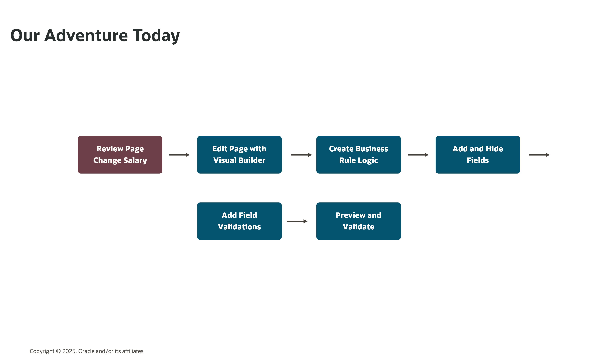

2. You will first navigate to the Change Salary Page.

    > (1) From the application home page, click on the **My Team** tab.

    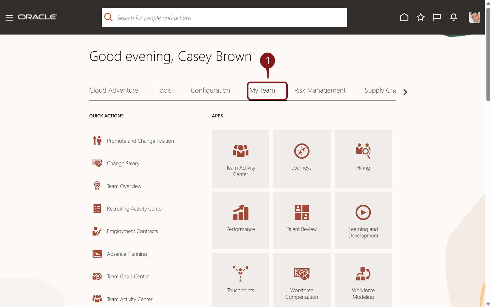.

3. You can access Change Salary from an individual worker record, from the search bar, or via the Quick Actions feature.

    > (1) Click on **Change Salary** under **Quick Actions**.

    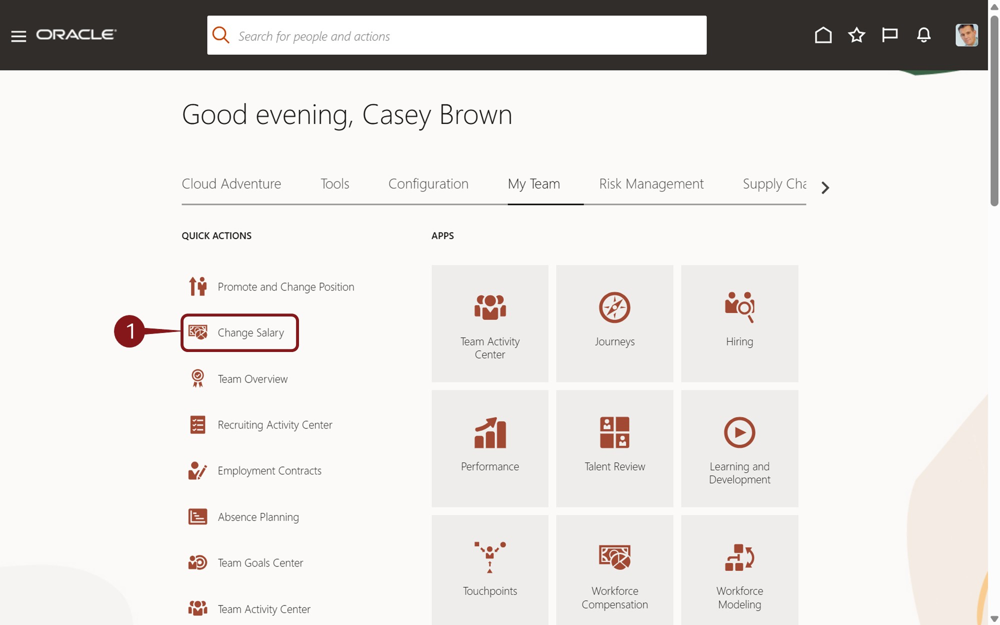

4. By default this screen shows information on any Direct Reports.  Since you don't have any, you can remove this filter.

    > (1) Click on the   **Icon** to remove the Direct Reports Filter because your user does not have any direct reports.  This action allows you to see other people.

    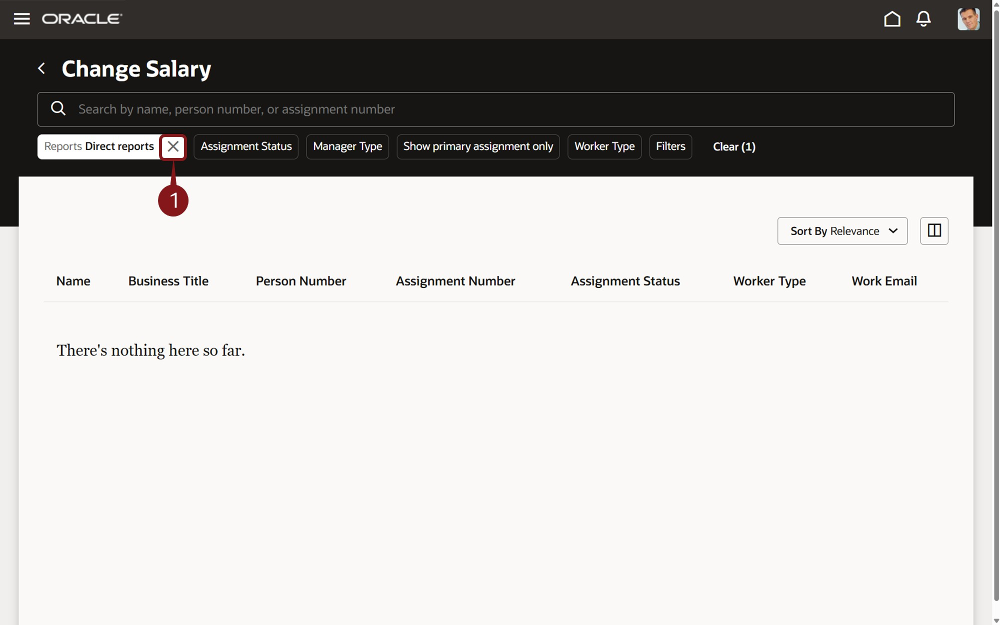

5. Now you will enter the Change Salary Form so we can make the required changes using Visual Builder Studio.  Now you will select a person so you can enter the Change Salary form.

    > (1) Search for **Barrett Reed** in the search field.  

    > (2) Select **Barrett Reed** in the drop down.  

    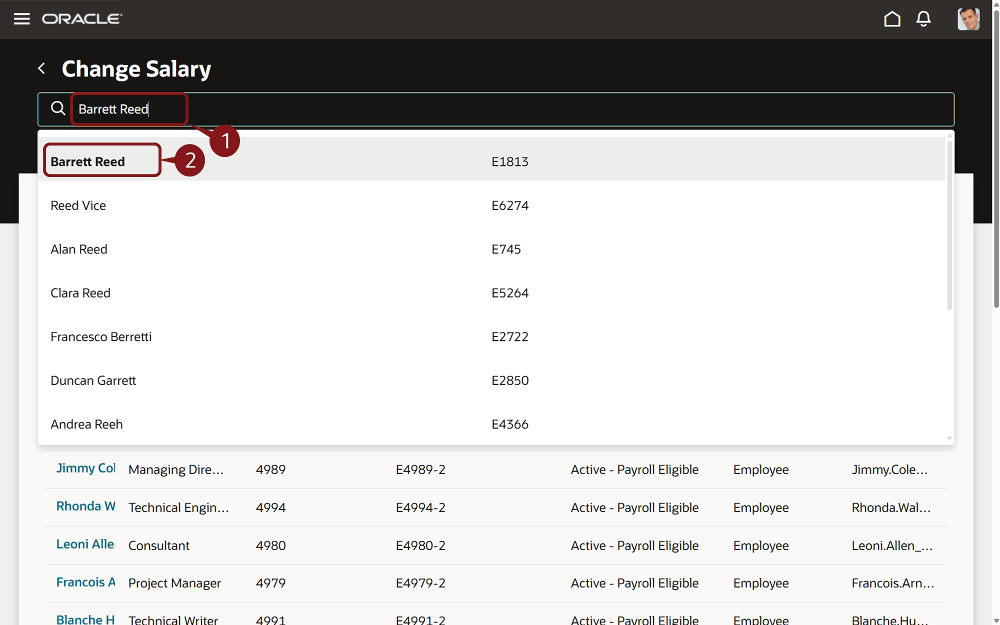

6.  You have entered the Change Salary Form.  Now you will quickly review the current configuration of the Change Salary Form.  You need to enter in some information to access the form

    > (1) When does the salary will start?: Type a **future date**  

    > (2) What is the action name?: Select **Change Salary**.  

    > (3) Why you are changing the salary?: Select **Career Progression**.  

    > (4) Click **Continue** once complete.

    

7. You will now create new rule that hides Annualized Full-Time Salary because it is repetitive.  You will also hide Compa-Raito since this is mainly used by HR.  You also want to show the action reason in this section of the Change Salary Form.  We can make these configuration changes by leveraging the embedded Vision Studio Builder capabilities.

    > (1) No action is required for Step 1.  Just note that the Annualized Full-Time Salary and Compa-Ratio fields are visible.  
    > (2) Click the **logged in user icon** icon  next to the bell icon in the top right corner of the screen and select **Edit Page in Visual Builder Studio** from the resulting drop-down.

    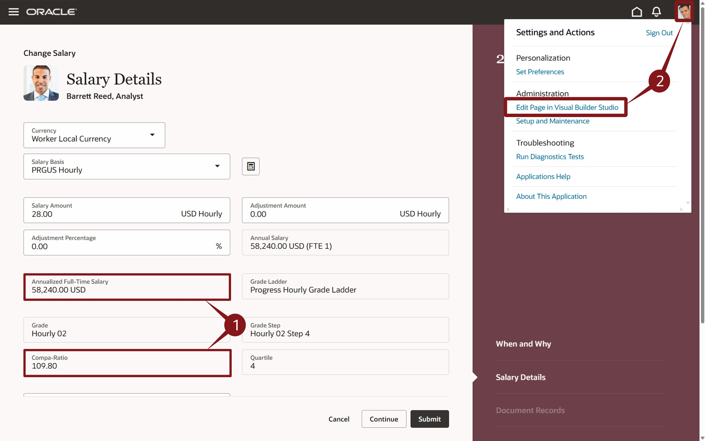

8.  Welcome to Oracle Visual Builder Studio (VB Studio), a robust application development platform that helps your team effectively plan and manage your work throughout all stages of the app dev lifecycle: design, build, test, and deploy. Now we will use VB Studio to make the required changes to the Change Salary Form.

    > (1) Click on **Configure Fields and Regions** button.

    

9. First we will create a new form rule for change salary.

    > (1) Click on the   **Icon** to add a new form rule.

    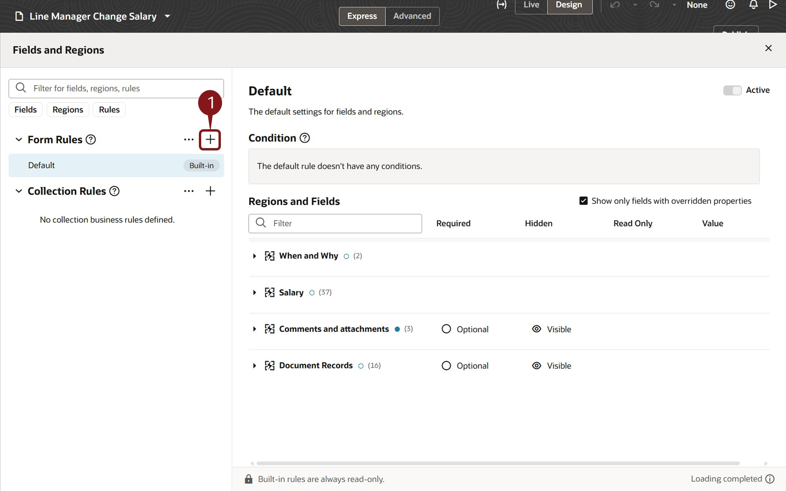

10. You can name your new rule and optionally include a description.

    > (1) Label: Type **Change Salary Non-HR**.  

    > (2) Click the **Create** button.

    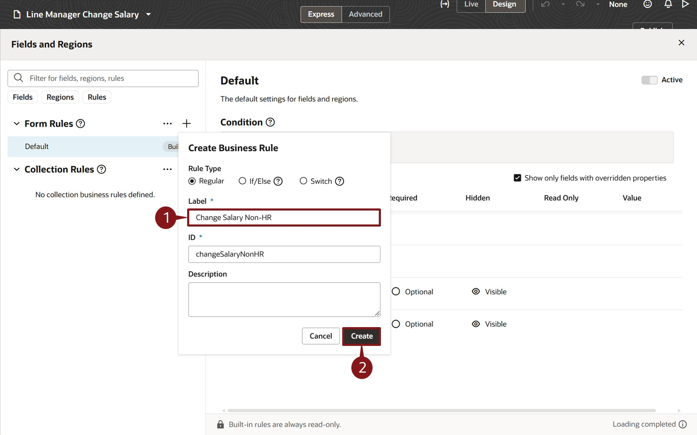

11.  You will add the Conditions for this rule to apply to all non-HR personnel.

    > (1) Click on the **Edit button.**

    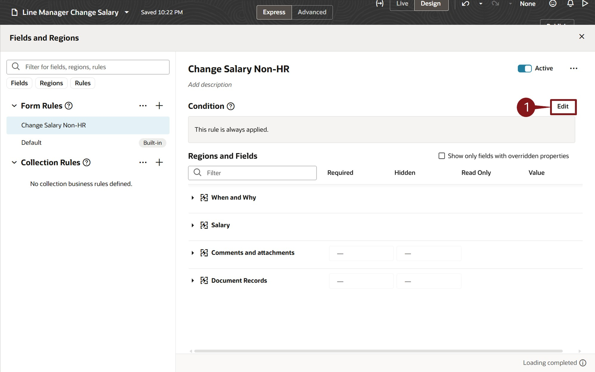

12.  You can complete the additional fields in User Roles condition in the first line. This configuration displays this version of the Change Salary Form to all people who are not assigned to the Human Resource Manager Role.

    > (1) For 2nd column in the **User Roles** row, select **does not contain** from the drop down.   

    > (2) For 3nd column in the **User Roles**, type **Human Resource Manager** and select **Human Resource Manager** from the resulting dropdown. 

    > (3) Click on the **Drop Down**   Icon to the left of Salary to expand the salary section

      

13.  Now you want to add and hide fields.

     > (1) Action Reason: select **Visible**      

     > (2) Annualized Full-Time Salary: select **Hidden**    

     > (3) Compa-Ratio: select **Hidden**   

     > (4) Click the  icon to complete the definition of this rule. 

     > (5) Click the  to close the Fields and Regions section.

     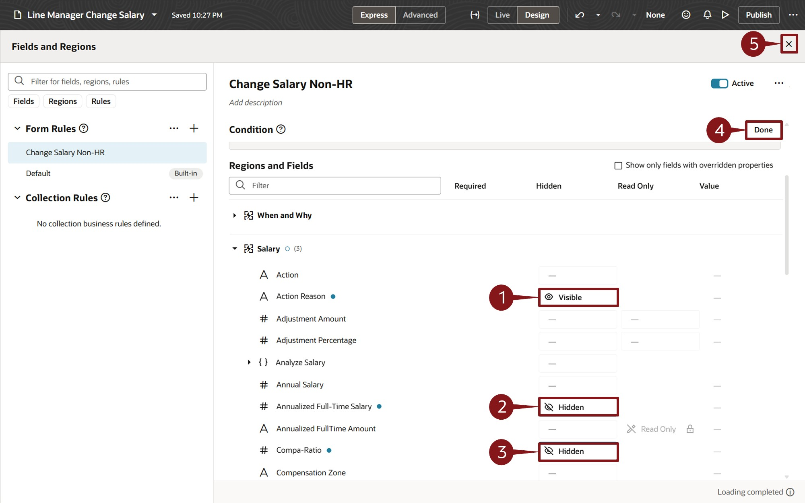

14. Now you will add a validation step for the Adjustment Percentage.  You do not want users to enter in a Salary Percentage Greater than 15%

    > (1) Click on **Configure Validations**

    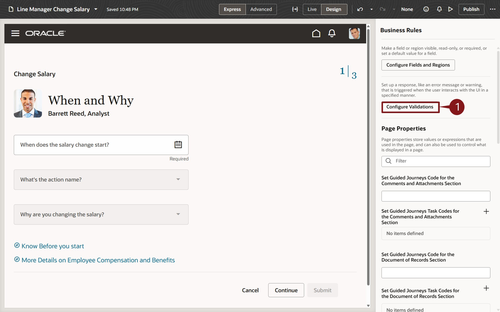

15. You can see any existing Validations and/or create new ones.

    > Click on **+ Validation**

    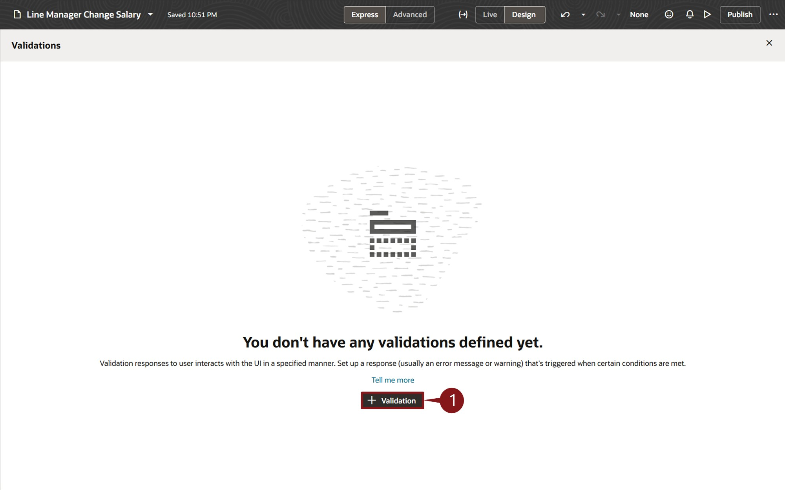

16. Your first step is the name your Validation.

    > (1) Label: type **Adjustment Percentage**.     

    > (2) Click the **Create** button.

    

17.  Now you will set the conditions for this rule so that the form will not accept any adjustment percentage greater than 15%.

     > (1) Click on **Edit**.

     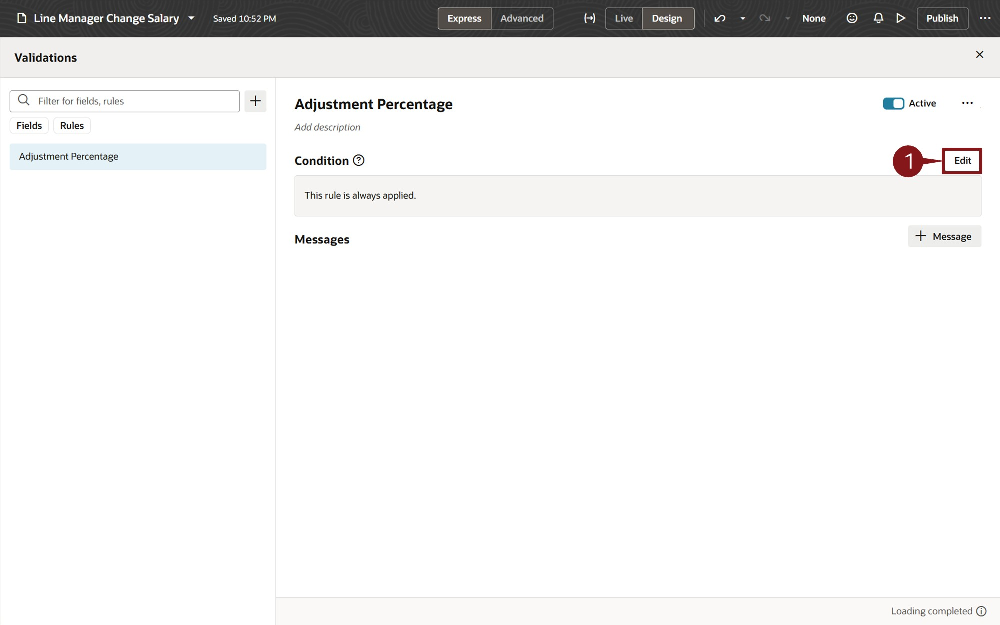

18.  Instead of using the pre-define condition rows, you'll create a new one.

     > (1) Click on **+ Condition**.

     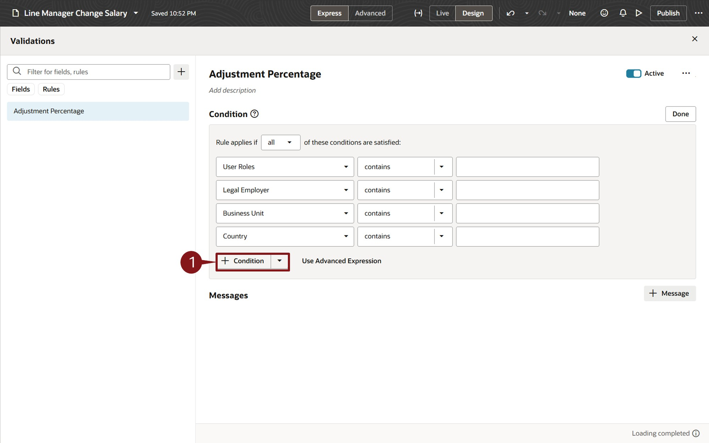

19.  For the first field on the condition, you'll want to use the Adjustment Percentage.   **Note:** **Adjustment Percentage** will appear multiple times in the list of values, so be sure to select the correct one as described below.

     > (1) Type **Adjustment Percentage** in the box and select the 1st **# Adjustment Percentage** under **Salary Details** from the resulting list of values.     

     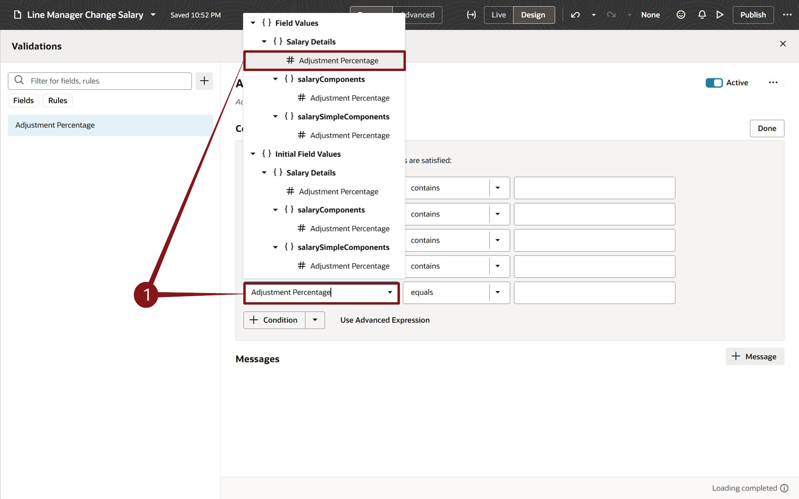

20.  For the second field on the condition, you'll specify the operator.

     > (1) Select **greater than** from the dropdown.    

     

21.  For the third field on the condition, you'll specify the comparison value.  **Note:** if the 3rd data entry field is obscured by the list of values, press the esc key on the upper left of your laptop keyboard.

    > (1) Type **15**

    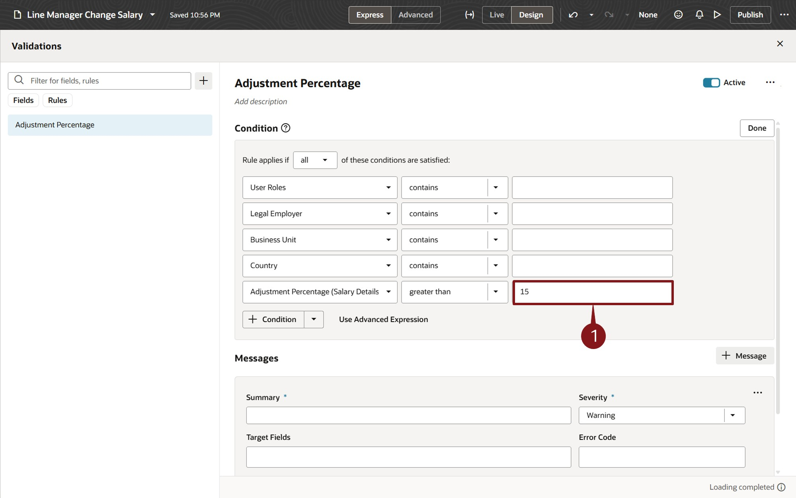

22. Now you will configure the error message users will see if they enter an Adjustment Percentage greater than 15%.

     > (1) Summary: type **Adjustment Percentage is too high**.     

     > (2) Severity:  Select **Error**.  

     > (3) Detail:  type **The Adjustment Percentage must be lower than 15%**.  

     > (4) Click the  icon to complete the definition of this rule. 

     > (5) Click the  to close the Validations section.

     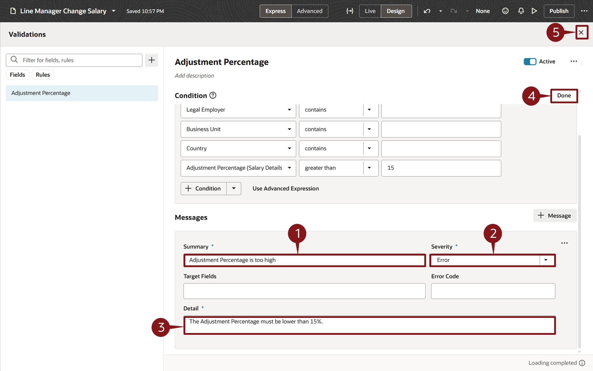

23.  Well done.  You have configured a new rule for Non-HR personnel.  You can quickly review your changes as they appear in the application.

    > (1) Click on the **Preview**  icon in the top right of the screen.
        **Note:** This will open the application in a new browser tab. 

       

24.  You have re-entered the Change Salary Form.  Let’s review the changes.  You need to enter the required information before you can move to the next screen.

    > (1) When does the salary will start?: Type a **future date**  

    > (2) What is the action name?: Select **Change Salary**.  

    > (3) Why you are changing the salary?: Select **Career Progression**.  

    > (4) Click **Continue** once complete.

     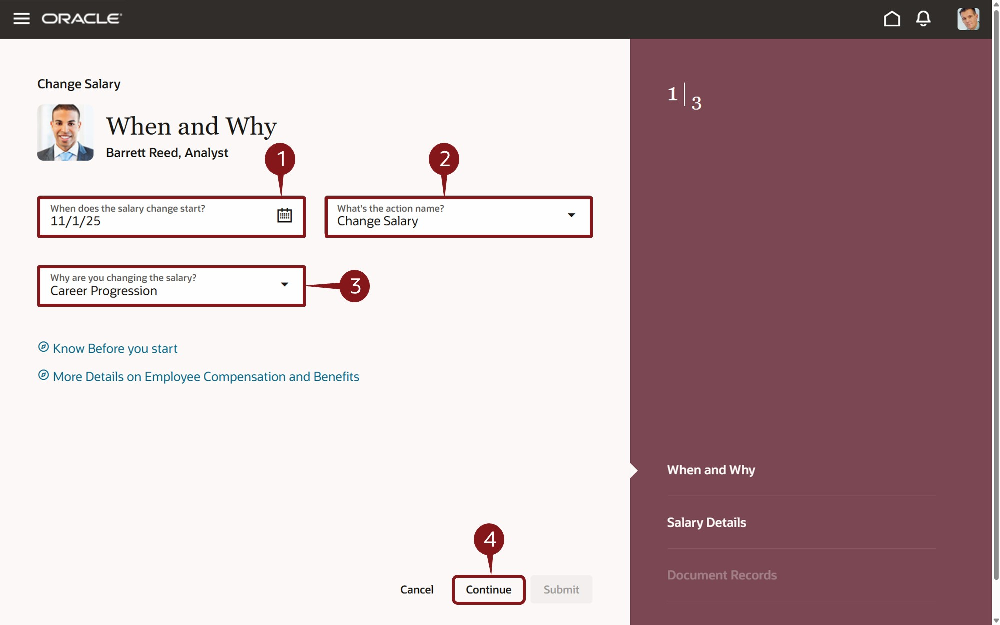

25.  Note that Annualized Full-Time Salary and Compa-Ratio are no longer visible and Action Reason is now Visible. Now you will test the validation for the Adjustment Amount Percentage.

    > (1) Enter an Adjustment Percentage that is greater than 15% and either **tab** out of the field or press the **Enter** key on the keybord.

    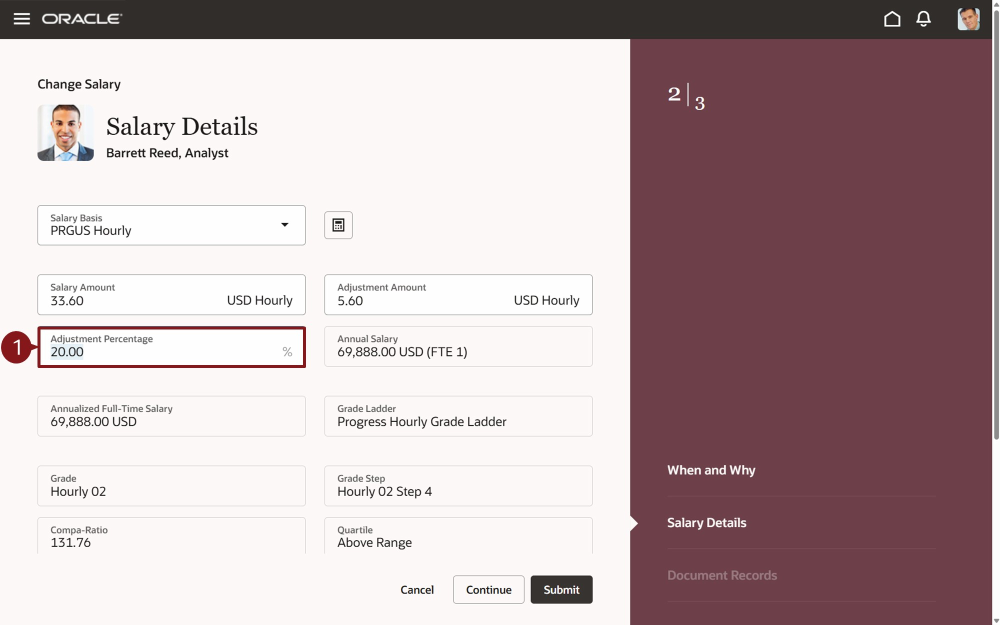

26.  The system will not allow the user to continue because the Adjustment Percentage exceeds 15%!

    

27.  Congratulations!  

    > You've completed this Adventure.  Please close this tab and the Visual Builder tab and get ready for your next Adventure.

27. Adventure awaits, click on the image, show what you know and rise to the top of the leader board!!!

    

### Summary

The two tasks of this Extension adventure introduced you to a few of the capabilities that customers can leverage to extend Oracle Fusion Cloud applications.  These features allow you to fine tune your Oracle Fusion Cloud Applications for peak performance, business processes tailored to you requirements, and fast, efficient usage.

You learned how to extend the applications using Oracle Visual Builder Studio to create new screens that leverage both Oracle and non-Oracle data. You also learned how to setup and defined a Guided Journey, which provides your users with the real-time, inline guidance and information required to complete their tasks.

You also learned how to leverage 3rd party Generative AI capabilities by leveraging external LLMs directly from the Guided Journey feature of Oracle Fusion Cloud Applications.
So, check your with you team, double-check your racing harness and get ready for our next Adventure.

### Learn More

- [Extending Oracle Cloud Applications with Visual Builder Studio](https://docs.oracle.com/en/cloud/paas/visual-builder/visualbuilder-building-appui)
- [Overview of Guided Journeys](https://docs.oracle.com/en/cloud/saas/human-resources/24c/faijh/overview-of-guided-journeys.html)
- [Configure User Defined Content Task Type for a Journey](https://docs.oracle.com/en/cloud/saas/human-resources/24c/faijh/configure-user-defined-content-task-type-for-a-journey.html)
- [Oracle Documentation](http://docs.oracle.com)

## Acknowledgements
* **Author** - Charlie Moff, Distinguished Cloud Technologist, Advanced Technology Services; Casey Doody, Cloud Technologist , Advanced Technology Services
* **Contributors** -  Sajid Saleem, Master Principal Cloud Technologist, Advanced Technology Services
* **Last Updated By/Date** - Casey Doody, August 2025

