# Create AI

<!-- rem ## Path 1: Analytics -->

## **Path 1: ERP & HCM: Unify finance and workforce-related data to understand changing workforce dynamics and gain comprehensive insights**

### **Introduction**

Oracle Fusion Data Intelligence Platform (FDI) is a family of prebuilt, cloud native analytics applications for Oracle Cloud Applications that provides line-of-business users with ready-to-use insights to improve decision-making.

It is a Cloud application that delivers best-practice Key Performance Indicators (KPIs) and deep analyses to help decision-makers run their businesses and individual contributors to operate their businesses. Oracle Fusion Data Intelligence Platform is built on top of Oracle Analytics Cloud and Oracle Autonomous Data Warehouse. This packaged service starts with Oracle Fusion Cloud Applications which you can deploy rapidly, personalize, and extend. The service extracts data from your Oracle Fusion Cloud Applications and loads it into an instance of Oracle Autonomous Data Warehouse. Business users can then create and customize dashboards in Oracle Analytics Cloud. It empowers business users with industry-leading, AI-powered, self-service analytics capabilities for data preparation, visualization, enterprise reporting, augmented analysis, and natural language processing.

This activity guide helps business users to investigate and research data, ask relevant questions to understand Trends, Patterns and Outliers.

### **Objectives**

In this activity, you will Create analytics across different lines of business to derive better business insight

Estimated Time: 15 minutes

Do not forget to answer the Adventure Check Point questions at the end of the exercise!

### **Begin Exercise**

1. In this activity, you will Create analytics across different lines of business to derive better business insights.

    Cross-functional reporting analysis between ERP & HCM involves integrating data from core business operations finance with workforce-related data (such as employee performance, payroll, and workforce planning) providing comprehensive insights for decision-making, enabling organizations to align their human resource strategies with broader business objectives.

    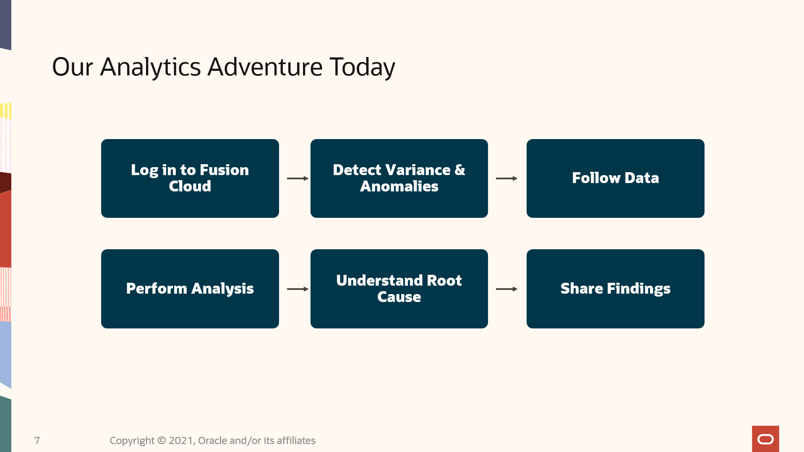

2. Oracle Fusion Data Intelligence Platform is a family of prebuilt, cloud-native analytics applications for Oracle Cloud Applications that provide line-of-business users with ready-to-use insights to improve decision-making.

    > (1) Click on the **‘Analytics’** tab  
    > (2) Click on **‘Fusion – Analytics Data Intelligence’** icon  

    

3. After a successful login, you will land on the Oracle Analytics home page.

    > (1) Enter assigned username and Fusion Analytics Password   

 > (2) Click on the ‘Sign In’  

    

4. A finance Watchlist comprising several Tiles is available on the home page.

    One metric that draws my attention is Margin, which is trending low.

    Two attributes that influence Margin are Revenue and Cost. Since revenue seems to be increasing, let's investigate Cost.

    > On the Margin Tile locate the **Open Workbook**  Icon on the top right corner and click on it.

    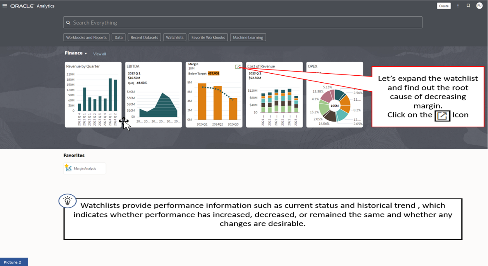

5. This action expands the Tile and opens the workbook.

    Let's now set the workbook to design mode so that we can add cost elements.

    > Click on the Edit Icon    as shown in the image.   

    Instead of building manually, let's use the Auto Insights feature.

    > Click on the Auto Insights Icon    as shown in the image.

    

6.  Next, let’s expand the Auto Insights pane for better observability.

    > Click on the Expand / Shrink Icon    as shown in the image.

    

7.  The Auto Insights function has crawled the data set and brought expense-related information critical to our analysis. Let’s use the Top 10 Expenses by expense categories.

    > (1) Locate the “Top 10 Expense Categories by Expenses” insight and click the Add Icon    shown in the image. This will add the Insight to the Canvas.   

    > (2) Click on the **x** sign to close the Insights pane.

    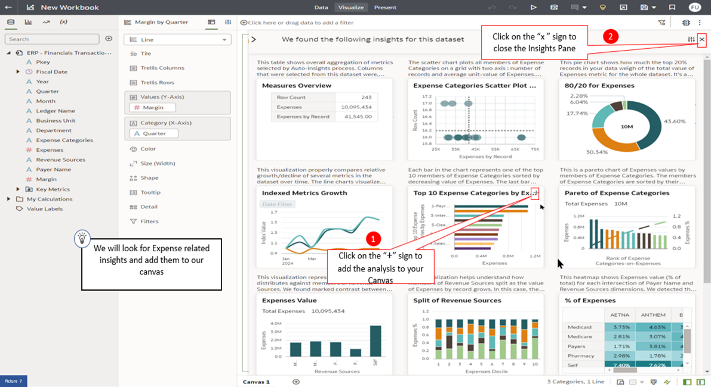

8.  Now, we can compare margin and cost side by side.

    Payroll expenses emerge as the highest cost. We will delve deeper into payroll expenses to identify their components.

    Our next step involves integrating Human Resources data into our analysis.

    

9.  Combining datasets from multiple “Lines of Business” allows an individual to conduct a deep dive into the actual problems.

    > (1) Expand the HCM Core transactions data set from the Data Panel on the left.   

    > (2) At the bottom of the Page, click the plus icon    to add another Canvas, **Canvas 2**.  

    > (3) While holding “Shift,” multi-select the Amount and Account columns and drag them onto Canvas 2.

    

    > (1) Change the chart to a “Stacked Bar” type to visualize the data better.   

    > (2) Follow steps 1 and 2 as shown in the picture 10.

    

10.  We need to perform trend analysis to understand when the expense anomaly started occurring and whether it is consistent across all expense types.

    > Drag the **Accounts** column from the Categories section into the Color section.

    

    > Next, expand the Fiscal Date folder in the Data Panel, locate the **Month** column, and drag and drop it into the Categories section.

    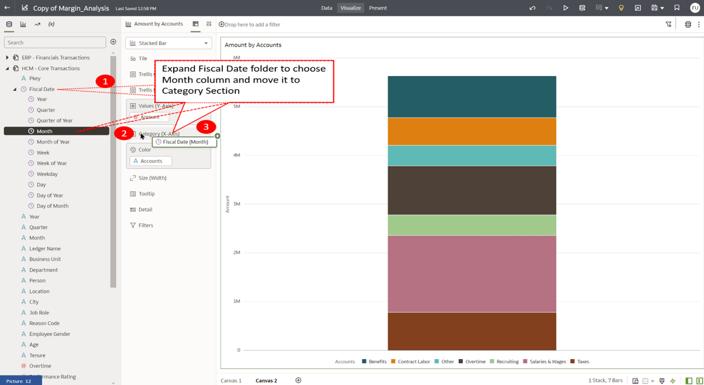

11.  We can now see expense amounts displayed across time and expense categories.

    On analyzing the trend, it appears that while Base Salary and Wages have remained constant, overtime and contract labor have increased since May.

    Let's explore and find out why overtime and contract labor have increased.

    

12. Overtime and Contract labor are typically associated with Turnover. Let's see if it had any impact.

    > (1) Expand the Fiscal Date folder in the Data Panel to locate the **Month** and **Turnover** columns.    

    > (2) While holding “Ctrl,” multi-select the **Month** and **Turnover** columns and drag them below the current visual.

    

13.  Another factor that impacts Overtime and Contract labor is employee absences.

    > Drag the **Absences** column from the data panel and drop it in the values section below the **Turnover** column.

    

    

14.  This brings all relevant columns onto the canvas. We can now co-relate several attributes and arrive at the correct conclusion.  We can now see the pattern clearly. Beginning in March, absences and turnover started increasing, which led to an increase in overtime and the hiring of contract labor.  This is ultimately reflected in the books of accounts in Finance.

15. Let’s understand how the trend looks like in the future. We will use the built in Statistical Analysis function like forecast to under the future

    > Right click anywhere in the **Turnover**, **Absences** Chart choose **Add Statistics** then **Forecast**

    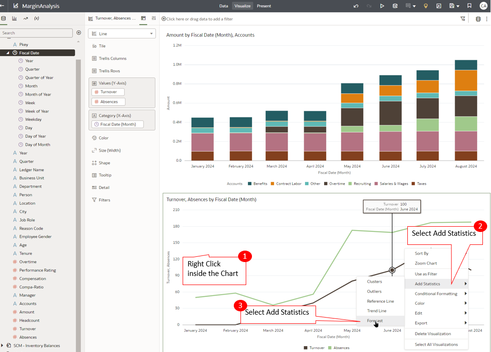

16. With a few simple clicks, you were able to forecast and understand the future trend.

    

17. Adventure awaits, click on the image and show what you know, and rise to the top of the leader board!!!

    

<!-- rem ## Path 2: Analytics with AI -->

## **Path 2: Use AI to derive better business insight**

### **Introduction**

Oracle Fusion Data Intelligence Platform (FDI) is a family of prebuilt, cloud native applications for Oracle Cloud Applications that provides line-of-business users with ready-to-use insights to improve decision-making.

It is a Cloud application that delivers best-practice Key Performance Indicators (KPIs) and deep analyses to help decision-makers run their businesses and individual contributors to operate their businesses. Oracle Fusion Data Intelligence Platform is built on top of Oracle Analytics Cloud and Oracle Autonomous Data Warehouse. This packaged service starts with Oracle Fusion Cloud Applications which you can deploy rapidly, personalize, and extend. The service extracts data from your Oracle Fusion Cloud Applications and loads it into an instance of Oracle Autonomous Data Warehouse. Business users can then create and customize dashboards in Oracle Analytics Cloud. It empowers business users with industry-leading, AI-powered, self-service analytics capabilities for data preparation, visualization, enterprise reporting, augmented analysis, and natural language processing.

This activity guide helps business users to investigate and research data, ask relevant questions to understand Trends, Patterns and Outliers.

### **Objectives**

Use pre-built machine learning based sentiment analysis to analyze employee sentiment (positive, negative or neutral) and emotion from survey interaction data.

Estimated Time: 15 minutes

Do not forget to answer the Adventure Check Point questions at the end of the exercise!

### **Begin Exercise**

1. In this activity, you will leverage pre-built machine learning capabilities (sentiment analysis) on survey data to understand employee sentiment.

    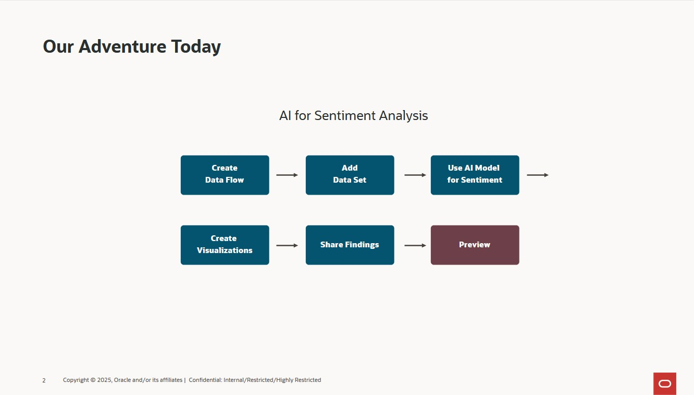

2. Oracle Fusion Data Intelligence Platform is a family of prebuilt, cloud-native analytics applications for Oracle Cloud Applications that provide line-of-business users with ready-to-use insights to improve decision-making.

    > (1) Click on the **‘Analytics’** tab.  

    > (2) (2) Click on **Fusion – Analytics Data Intelligence** icon.  

    

3. After a successful login, you will land on the Oracle Analytics home page.

    > (1) Enter your assigned username and Fusion Analytics Password.   

    

4. From home page, click on create button on top right corner to start the data flow process for building model out.

    > (1) Click on the **Create Button**.  

    

    > (1) Click on **Data Flow**.  

    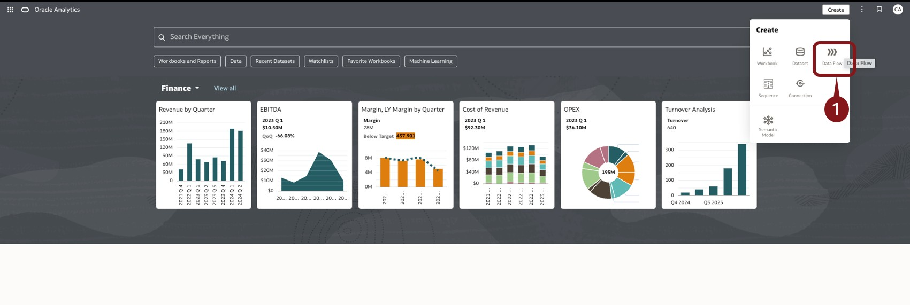

5. Data Flow page pops up but also a dialog box asking to Add Data.

    > (1) Within the Search box, type in **Survey** .  

    > (2) Select Data set named **Survey Data**.  

    > (3) Click **Add**.  

    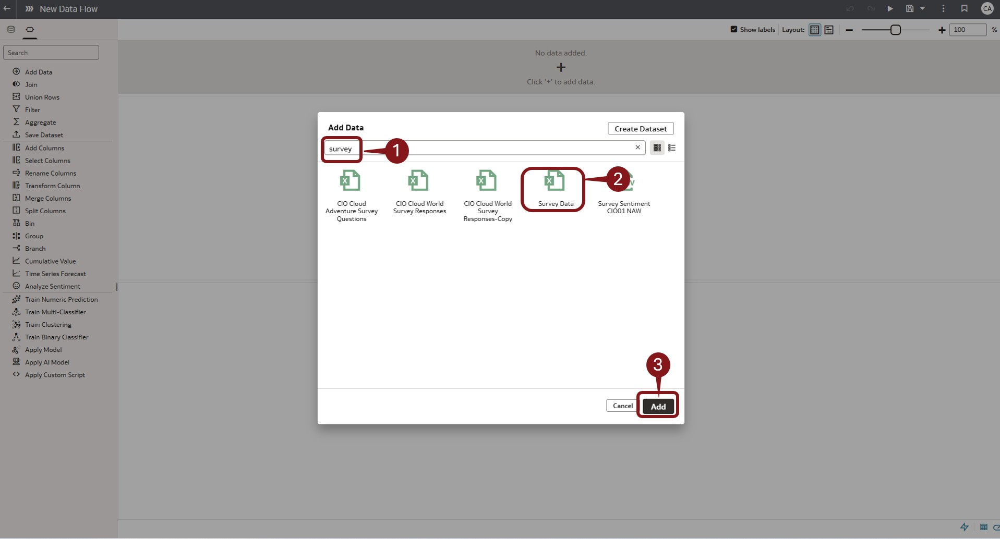

6. We will use pre-built machine learning based sentiment analysis to analyze Survey Data.

    > (1) Drag **Analyze Sentiment** on the left side until we get a blue box next to Survey Data.  

    

7. Now that we have “Analyze Sentiment” we have to point the model as to what we want it to analyze, In this case we want to have a sentiment analysis on employees comments. The Sentiment Analysis will analyze the comments and assign a positive, neutral, or negative attribute to each comment.

    > (1) Click on **Select a Column** .  

    > (2) Scroll down until you see **EmployeeComment**.  

    > (3) Click on **EmployeeComment**.  

    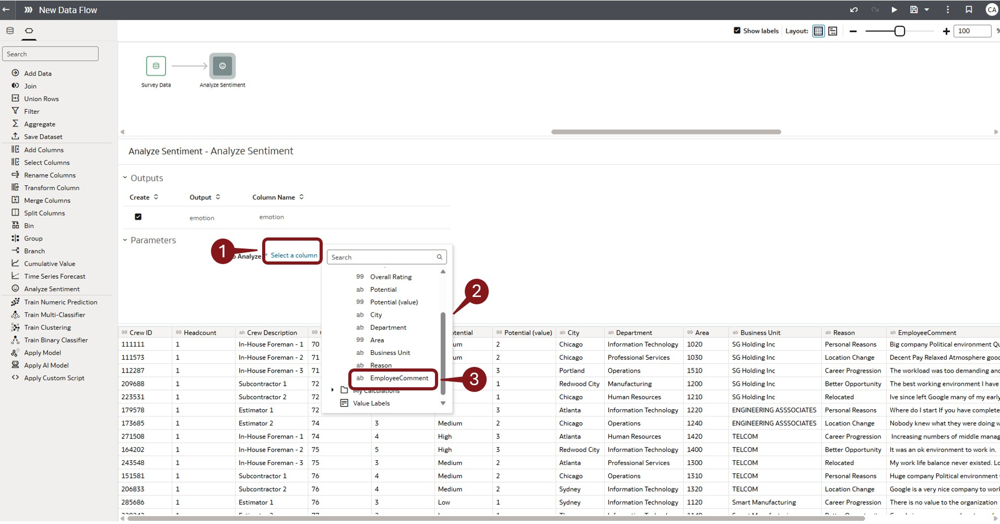

8. We are ready to save the model data.

    > (1) drag over “**Save Dataset** to our data flow.  

    

    > (1) Enter **Survey Sentiment CIOXX and your initials** in data set to name the data set.  

    > (2) Click the **Save** button.  

    

9. A dialog box pops up asking name to save Data Flow As.

    > (1) Enter **Sentiment Data Flow CIOXX and your initials**.  

    > (2) Click on **Ok**.  

    

10. Now you will run the data flow model.

    > (1) Click on the **Run** button.  

    

11. Will take approximately 30 seconds to run. You can start going back to build out a workbook with the data set generated.

    > (1) Click on the **back** button.  

    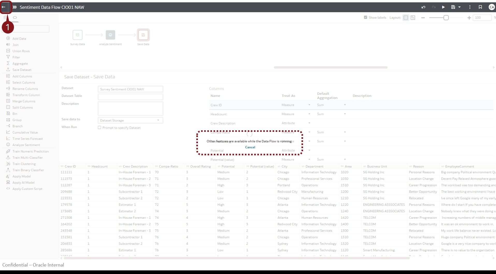

12. Now that we have Sentiment Data Flow created, lets build some analysis with the model.

    > (1) Click on the **Create** button.  

    > (2) Click on **Workbook**.  

    

13. Dialog pop up asking for what data we would like to Add.

    > (1) Enter **Survey** in the search bar.  

    > (2) Select the model you named with your initials.  

    > (2) Click on **Add to Workbook**.  

    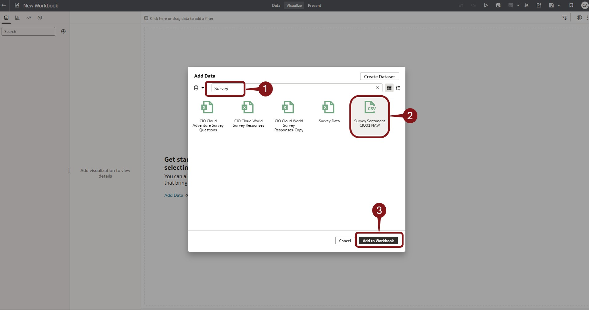

14. Notice that we have emotion as an attribute derived from sentiment analysis. We will start with analyzing head count based on emotion.

    > (1) Click and hold on ctrl, then select **emotion**.  

    > (2) Select **headcount** and drag both attributes into the canvas.  

    

15. Now we will move emotion to Color for better visualization

    > (1) Click and drag **emotion** onto color.  

    

    > (1) Drag over Department attribute to “Trellis Columns”.  

    

    > (1) While holding down the control key, select **emotion**.  

    > (2) Select **EmployeeComment**.  

    > (3) Drag both to the line below the current bar graph.  

    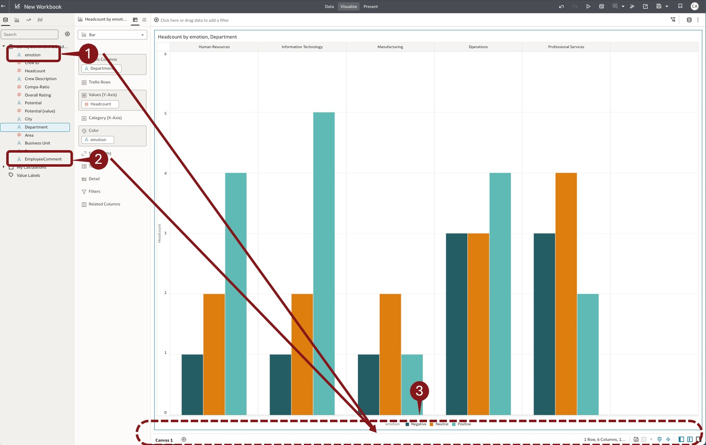

16. We can bring in the comments and add some color emotion to them.

    > (1) Click and drag **emotion** onto color.  

    

    > (1) Click on the bar chart to reveal the filter icon.  

    > (2) Click on the **Filter Icon**.  

    > (3) Then click on the **Preview Icon**.  

    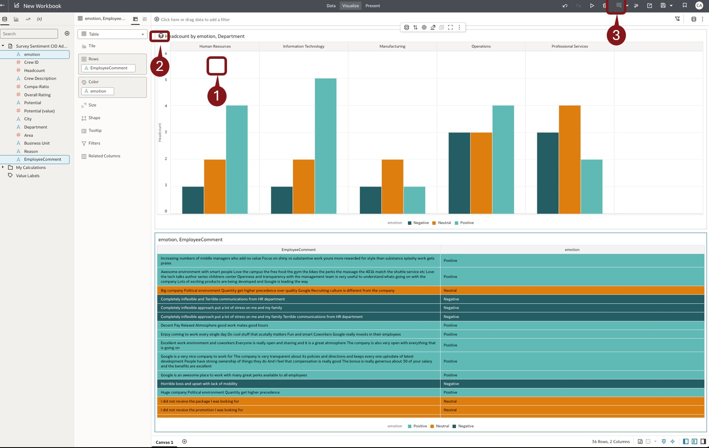

17. We see the survey results across all departments.  Now we will use the filter feature to look at the different sentiments.

    > (1) Click on any **green bar** to view all positive comments.  

    

    > (1) Click on any **orange bar** to view all neutral comments.  

    

    > (1) Click on any **blue bar** to view all positive comments.  

    

    

23. Adventure awaits, click on the image and show what you know, and rise to the top of the leader board!!!

    

### Summary

You discovered how effortlessly Fusion Analytics enables the creation of content and analysis of data. By integrating diverse data sources, you were able to delve deeper from summary information to detailed analysis, uncovering root causes. You then shared your discoveries with a broader audience, making the insights accessible and impactful.

**You have successfully completed the Activity!**

### Learn More

* [Get Started with Oracle Fusion Data Intelligence](https://docs.oracle.com/en/cloud/saas/analytics/24r3/index.html)
* [Oracle Documentation](http://docs.oracle.com)

## Acknowledgements

* **Author** - Sohel Jeelani, Distinguished Analytics Solution Engineer, Advanced Technology Services, Xavier Ramirez, Senior Analytics Solution Engineer, Advanced Technology Services, Nate Weinsaft, Master Principal Solution Engineer, Advanced Technology Services
* **Contributors** - The Cloud Adventure Team (Gus, Kris, Sajid, Casey, Stephen, Jamil, Sohel, Xavier, Nate, Charlie)
* **Last Updated By/Date** - Nate Weinsaft, October 2025