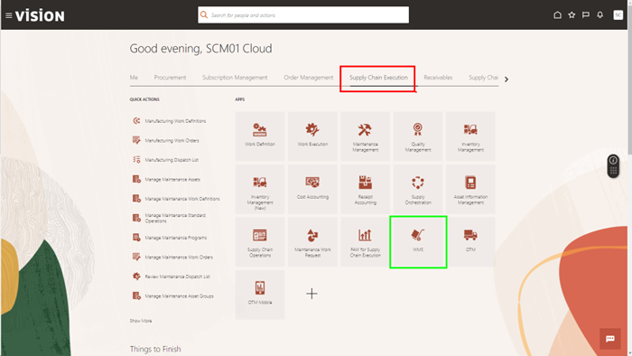
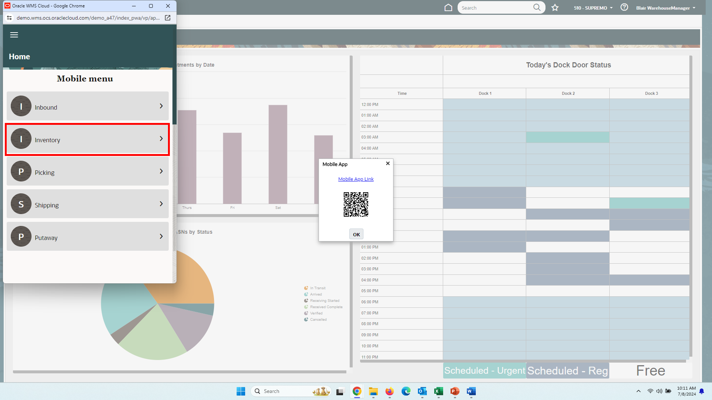
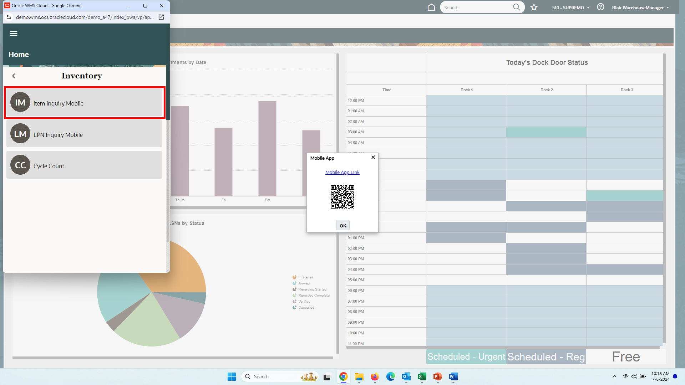
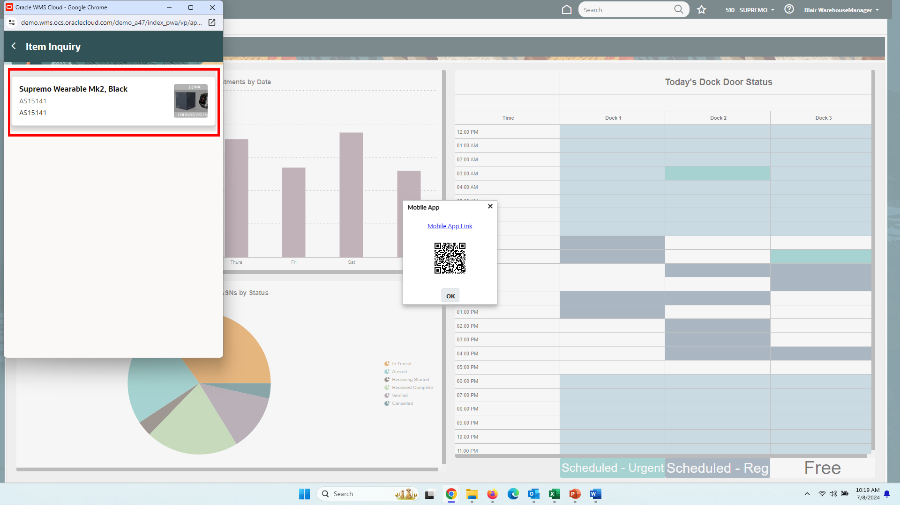
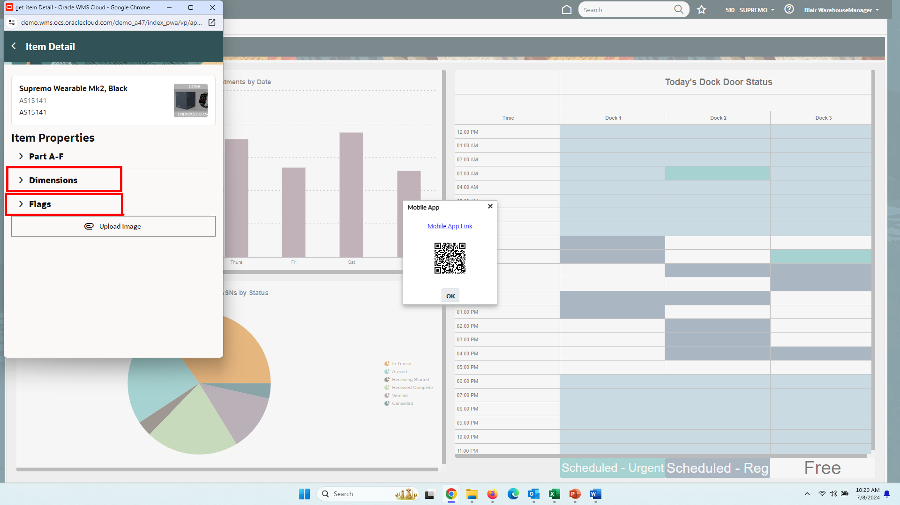
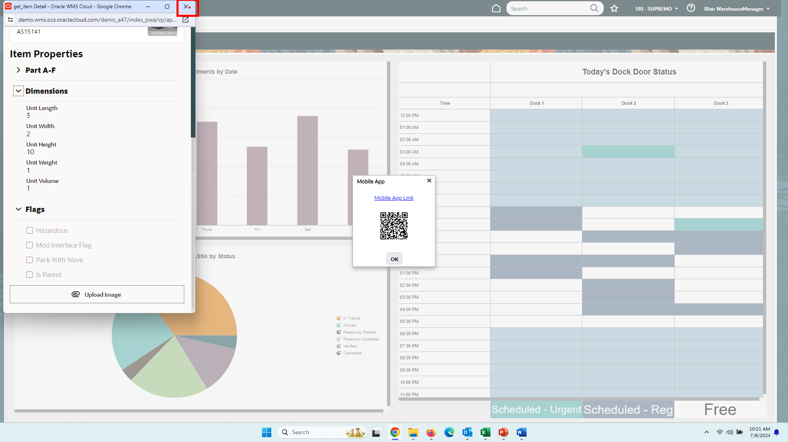
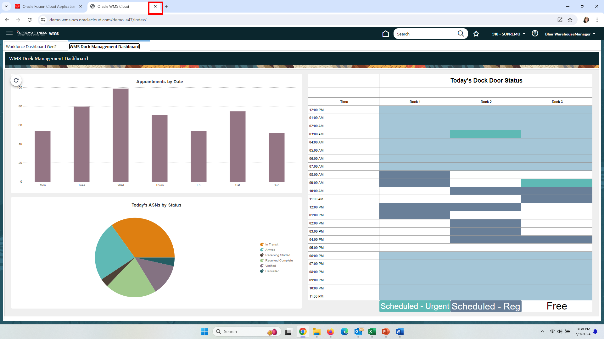

# Connections

## Introduction

This is a fresh and unique way to offer you a chance for hands-on experience of highly differentiated and specifically curated content of numerous vignettes that are typically encountered in accounting and finance. We hope you will enjoy today’s adventure exploring a complete and unified solution for the office of the CFO.

As you follow along, do not forget to answer the Adventure Check Point questions! 

Estimated Time: 5 minutes

### Objectives

In this activity, you will:
* Use Oracle Warehouse Management’s embedded Mobile App to look up item information.  
 

## Task 1: You would like to do an inquiry on an item.  

1. You are a warehouse operator leveraging the barcoding and scanning capabilities embedded into the WMS Cloud application.  You would like to do an inquiry on an item.  

    > Click on the **Supply Chain Execution** tab and select **WMS** from the Quick Actions List

    

2. With embedded mobility, users can execute transactions by leveraging our Mobile App or other supported RF scanning devices.  

    > Click on your user name on the top right corner **SCM_XX** and select **Launch Mobile App.**   

    

    > Click on **Mobile App** Link to open the app.

    

3. The inherent Mobile App allows end users to execute transactions using a mobile device with a graphical user interface.  Note the menu options the user can select.

    > Click on **Inventory.**

    

4. Various options are presented to the user on the Mobile App including the ability to inquire on item information, LPN (license plate number) information, or execute a cycle count.

    > Click on Item **Inquiry Mobile.**

    

5. Let’s enter the barcode of the item we want to search.  Note that this could also be done using a barcode to scan the item number. 

    > Enter the item number **AS15141** then click **Search.**

    

6. You can easily see what the item should look like as well as any alternate item numbers.

    > Click **Supremo Wearable Mk2, Black.**

    

7. We can use the Mobile App to view item details such as part relationships, dimensions, and flags that drive decisions.

    > Select drop downs for **Dimensions** and **Flags.**

    

8. Dimensions help identify where an item can be put away.  Flags help to determine if items can be mixed with other items or if they can be packed with a wave.  Information that helps WMS drive directed movements. 

    > Once you have reviewed the Dimensions and Flags, click **X** to close the mobile app.

    

    > Close the browser using the **X** icon to return to the Fusion landing page.

    

9. Adventure awaits, click on the image, show what you know and rise to the top of the leader board!!!

     

## Summary

Oracle Warehouse Management transforms warehouse and inventory management for the new and evolving fulfillment economy. The solution combines the speed and savings of the cloud with best-of-breed fulfillment functionality while giving companies a 360-degree view of their inventory without the high maintenance costs and upgrade trap of traditional solutions.

Today’s modern warehouse managers aren’t tied to a desk. They need access on the go to critical information to make smart decisions. With Oracle Warehouse Management, mobility is inherent, having been built-in from day one. Managers can view real-time analytics and reporting while users can perform all the essential activities (pick, pack, load, ship/manifest support, kitting, de-kitting, etc.)
to power best-in-class fulfillment operations.

In this example, we used Oracle Warehouse Management’s embedded Mobile App to look up item information.  

**You have successfully completed the Activity!**

p

**You may now proceed to the next lab.**

## Acknowledgements
* **Author** - Tracy Mengyan, Master Principal Solution Engineer
* **Contributors** -  Betty Jane Madden, Principal Solution Engineer
* **Last Updated By/Date** - Tracy Mengyan, July 2024

