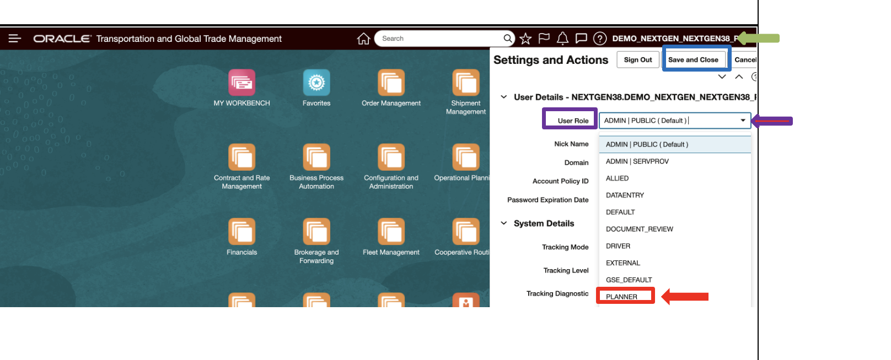
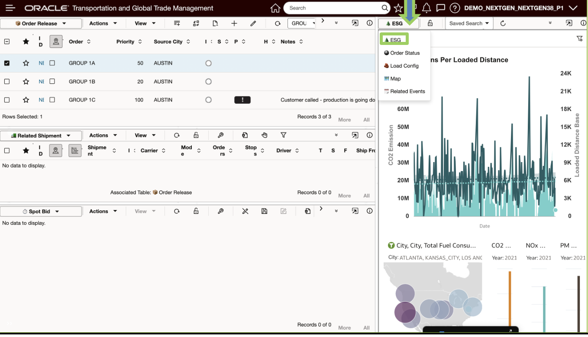
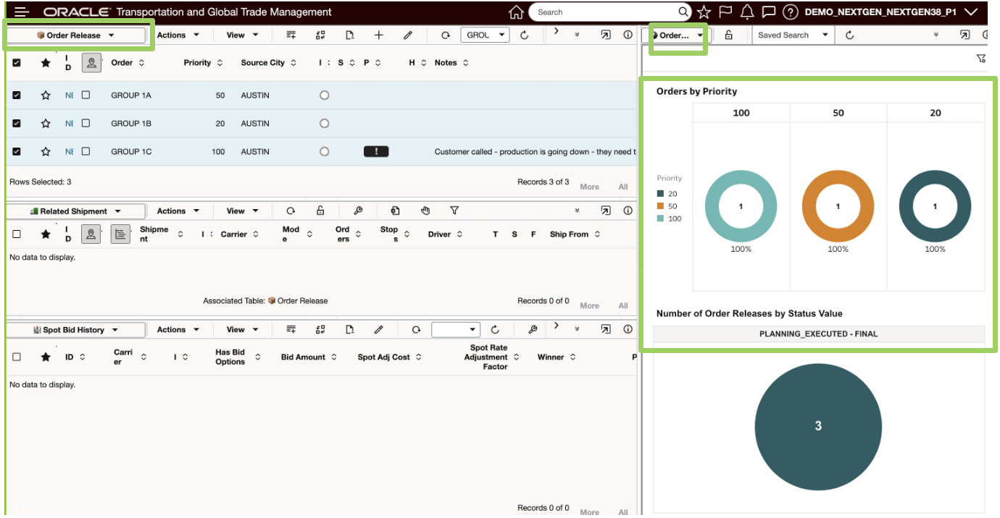
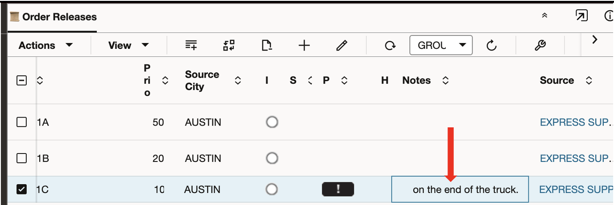
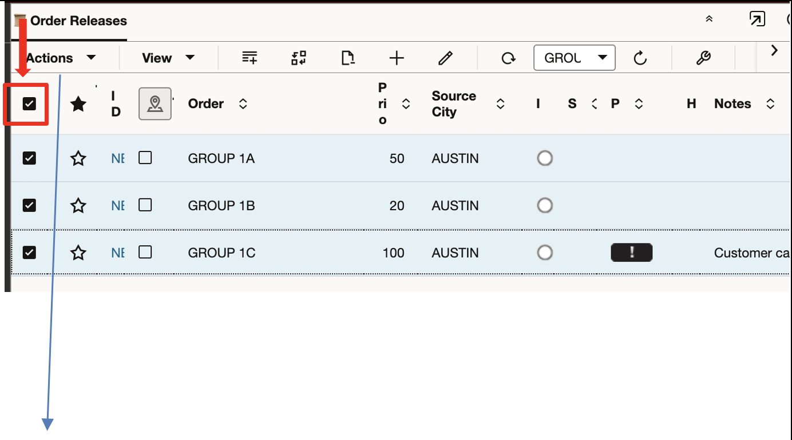
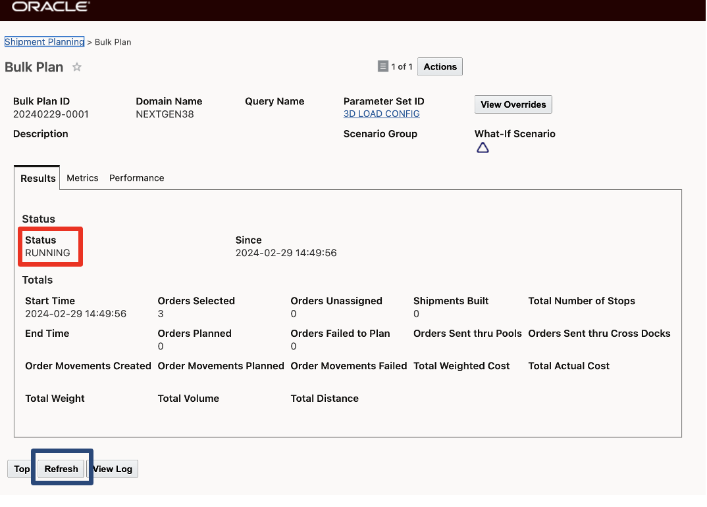
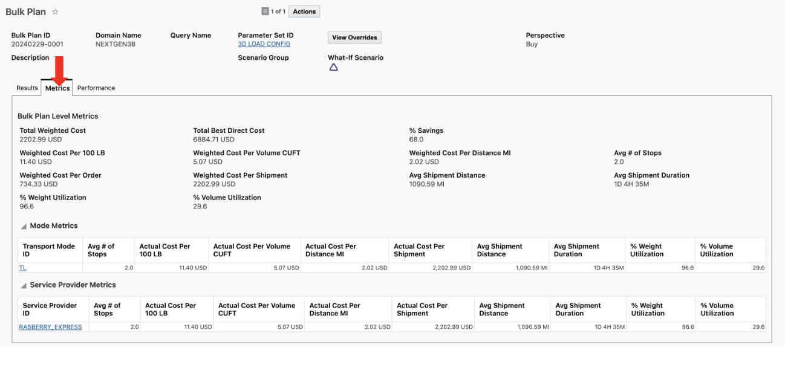
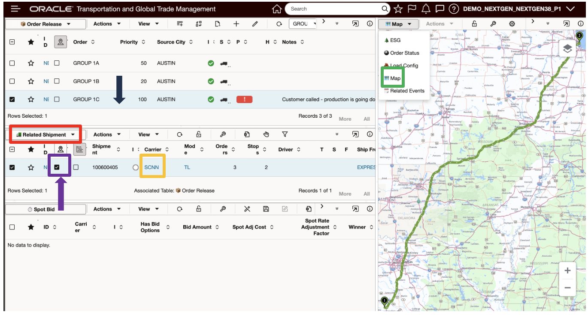
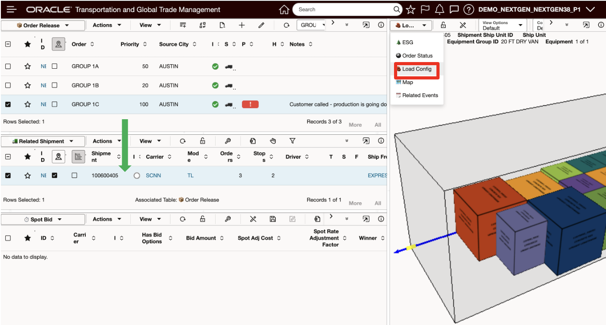

# Connections

## Introduction

Welcome to Oracle’s Cloud Adventure.  This is a fresh and unique way to offer you a chance for hands-on experience of highly differentiated and specifically curated content of numerous vignettes that are typically encountered Supply Chain Management. We hope you will enjoy today’s adventure exploring a complete and unified solution for the office of the COO.

As you follow along, do not forget to answer the Adventure Check Point questions! 

Estimated Time: 11 minutes

### Objectives

In this activity, you will:
* Use Oracle Transportation Management’s Operational Planning to review, optimally plan and execute all order types. Utilizing the OTM Workbench, users have access to all pertinent data necessary to review dashboards and perform relevant logistics activities.  By leveraging OTM, businesses can achieve improved visibility, increased efficiency, and reduced costs in their logistics operations.

 

## Task 1: ESG Dashboards and Analytics 

1. Casey changes her role from Admin to Planner so she can focus on the key tasks at hand.

    > Select the down **arrow** to the right of the User Name **DEMO_NEXTGEN_NEXTGEN38_P1**. Select the down arrow in the User Role.  Select the role of **PLANNER**.  Select **Save and Close**.

    

2. A workbench automatically opens allowing Casey to focus on the task at hand.  

    Casey realizes the importance of meeting the company’s ESG goals.  She quickly reviews their performance metrics for CO2 and NOx Emissions.

    > Click on the **ESG tab** in the right panel of the workbench.

    

3. A workbench automatically opens allowing Casey to focus on the task at hand. 

    Casey starts by reviewing the operational dashboards to review any exceptions.  Upon examination, Casey discovers some new orders have arrived **with different priorities88.  

    > Review the orders by priority in the **Order Releases Tab**, as well as the **Order DV** (Data Visualization) tab.

    

4. **Every group will be provided the name of their order query**

    > **Group XX...** Users will need to use the drop down to change to their query set.

    

5. Casey reviews the new orders listed in the order releases tab.
    
    Casey can review more information about the order by expanding the tab.

    > Select the arrow to expand the box.  

    When done reviewing - **ReSelect** the arrow to pop the panel back in place.

    

6. Casey notices one of the orders has a red flashing exclamation point.  She reviews the notes that were entered by customer service in ERP, which automatically updated the order in OTM 

    > Casey sees there is a note on the priority order.  **Double click on the note** and use your arrow keys - left then right - to see the message from Customer Service.

    

    - to understand why this symbol was populated.
    
    Utilizing the Workbench functionality, Casey can easily get to all the information she needs to do her job.
   
    Casey reviews the notes and now understands what the customer has requested.

    
## Task 2: Planners plan 3 orders into a shipment

1. Casey is ready to run a plan that will determine the best mode, carrier, and route for each of these new orders using Oracle’s industry leading Optimization technology to determine the best way to guarantee the customer meets their on-time requirements. 

    > **Click** on the check box in the header row – **this will automatically select all 3 new orders.**

    Select **Actions – Bulk Plan**

    A New Box will pop open labeled Shipment Planning

    **Select** the **OK** bottom at the bottom left.

    

    

    A new window will open showing the details of Shipment Planning/Bulk Plan.  
    
    The plan will start with the **Status of Running**.
    
    **Hit Refresh** at the bottom left every few seconds until the Status turns to **Completed (see next screen shot)**.

    

    

2. Casey quickly reviews the other bulk plan tabs to ensure all looks good.

    > Click on the Metrics tab and review the results.
    
    This tab can be closed after review.

    

## Task 3: View Shipment with Load Configuration

1. Back on the workbench, Casey can view the assigned carrier is **SCNN**.  She can also view the planned route on the map.

    > **Select** the **Map tab** on the top right panel.

    **Select** any order by clicking anywhere in the row to highlight it (the row will turn light blue). 
    
    The **Related Shipment** will automatically populate in the **Related Shipments** panel below.

    **Select the check box** in the mapping column to add the shipment to the map.

    

2. Casey also knows that based on their configuration in OTM, the application will automatically ensure that high priority orders will be positioned based on their importance.  The optimization creates a 3D visual representation of the load that allows the warehouse to efficiently load the truck based on the order priority.   Casey reviews the visualization and is happy to see that OTM recognized that the high priority order is placed closest to the door – ready for the customer to easily unload the critical item that confirms Casey’s customer can continue production without interruption.

    > **Select** the **Load Config** tab on **the top right panel**.
        
    **Highlight** the shipment by clicking anywhere in the row.

    

    > **Change** the **Color Scheme** to **Priority**.
    
    Users have the ability edit the configuration by clicking on the pencil. 

    

3. Adventure awaits, click on the image, show what you know and rise to the top of the leader board!!!

     

## Summary

In the old days, Casey would have had to review each of the outbound shipments, find the deliveries on the floor, ask the warehouse loader to find the box and see if it will fit at the end of the truck.  Casey is happy that OTM did all the heavy lifting for her allowing Casey to spend time on more strategic tasks like how the company is performing toward the company’s ESG goals.  Casey can easily view this information by selecting one of the Data Visualization tabs in the Control Tower Workbench. 

**You have successfully completed the Activity!**

**You may now proceed to the next lab.**

## Acknowledgements
* **Author** - Rebecca Hoffman, Principal Solution Engineer
* **Contributors** -  Betty Jane Madden, Principal Solution Engineer
* **Last Updated By/Date** - Rebecca Hoffman, July 2024

